# 🔒 Implementar un entorno seguro

**Tiempo estimado: 30 minutos**

Has sido contratado como administrador sénior de bases de datos para ayudar a garantizar la seguridad del entorno de bases de datos de `AdventureWorksLT` en Azure SQL Database.

> 📝 **¡Atención!**
> Estos ejercicios te piden que copies y pegues código T-SQL. Por favor, verifica que el código se haya copiado correctamente antes de ejecutarlo.

---

## 🚀 1. Entorno de configuración

Si tu máquina virtual ya está configurada, deberías encontrar los archivos en `C:\LabFiles` y puedes **omitir esta sección**. Si no, sigue estos pasos:

1.  Inicia **Visual Studio Code**.
2.  Abre la paleta de comandos (`Ctrl+Shift+P`).
3.  Escribe `Git: Clonar` y selecciona esa opción.
    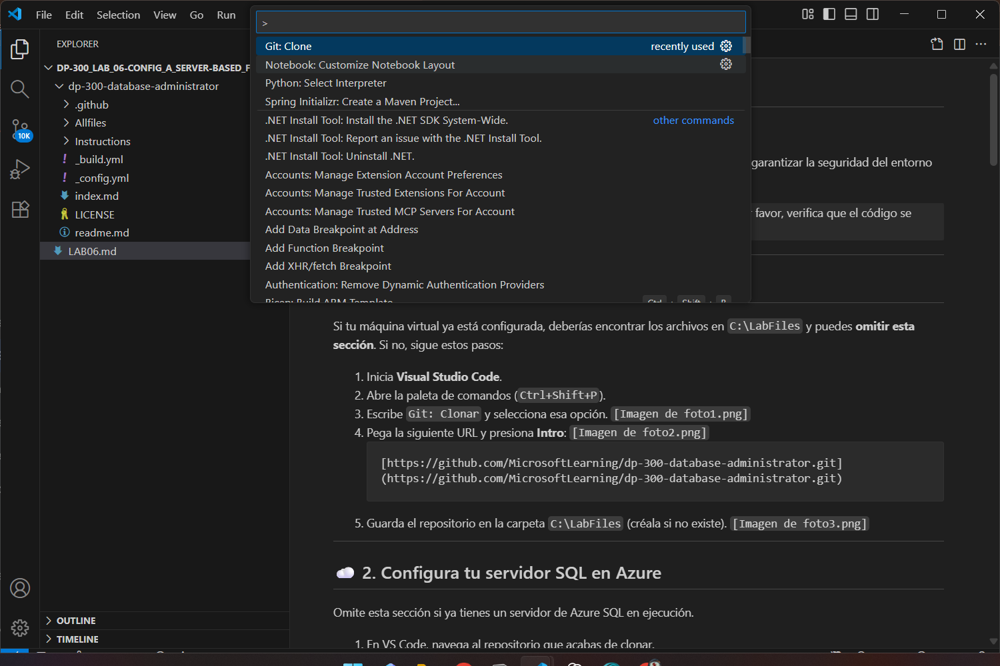
4.  Pega la siguiente URL y presiona **Intro**:
    
    ```
    [https://github.com/MicrosoftLearning/dp-300-database-administrator.git](https://github.com/MicrosoftLearning/dp-300-database-administrator.git)
    ```
5.  Guarda el repositorio en la carpeta `C:\LabFiles` (créala si no existe).
    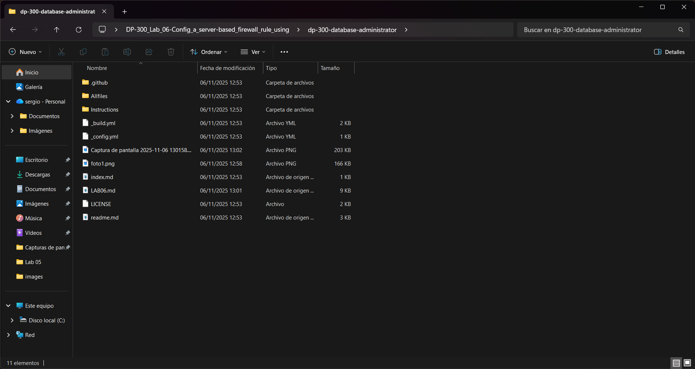

---

## ☁️ 2. Configura tu servidor SQL en Azure

Omite esta sección si ya tienes un servidor de Azure SQL en ejecución.

1.  En VS Code, navega al repositorio que acabas de clonar.
2.  Haz clic derecho en la carpeta `/Allfiles/Labs` y selecciona **Abrir en la terminal integrada**.
    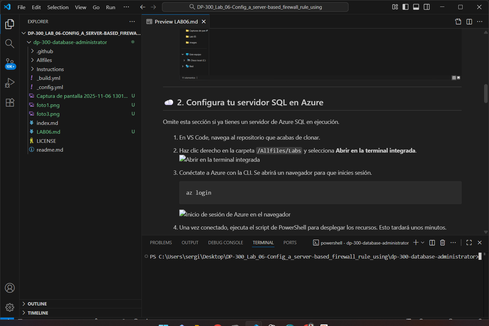
3.  Conéctate a Azure con la CLI. Se abrirá un navegador para que inicies sesión.
    ```bash
    az login
    ```
    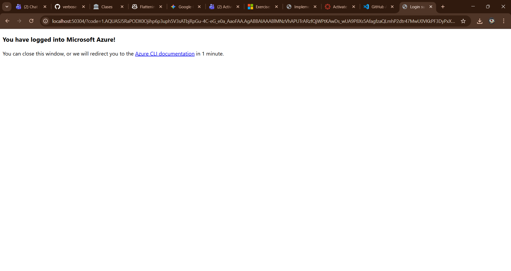
4.  Una vez conectado, ejecuta el script de PowerShell para desplegar los recursos. Esto tardará unos minutos.
    ```powershell
    cd ./Setup
    ./deploy-sql-database.ps1
    ```
    > 📝 **Notas sobre el script:**
    > * **Grupo de recursos:** Creará o usará uno llamado `contoso-rg`.
    > * **Ubicación:** Usará `westus2` (Oeste de EE. UU. 2).
    > * **Firewall:** Añadirá tu IP pública actual a las reglas del servidor.
    > * **Contraseña:** Generará una contraseña aleatoria de 12 caracteres.
    > * **Personalización:** Puedes cambiar estos valores con los parámetros `-rgName`, `-location` y `-sqlAdminPw`.

5.  **¡IMPORTANTE!** Al finalizar, el script mostrará el nombre del grupo de recursos, el nombre del servidor SQL, la base de datos, el usuario admin y la contraseña. **Anota estos valores.**
    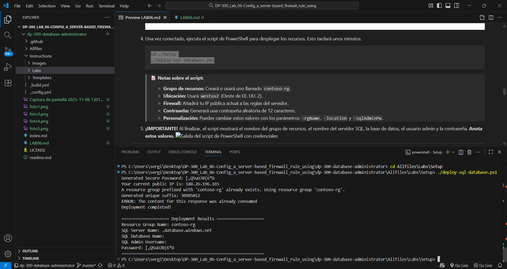

---

## 🛡️ 3. Configurar las reglas de firewall

Ahora, vamos a importar la base de datos `AdventureWorks` y a configurar la seguridad.

### A. Configurar el Firewall a nivel de Servidor

1.  Ve al portal de Azure (`https://portal.azure.com`).
2.  Busca y selecciona **Servidores SQL**.
    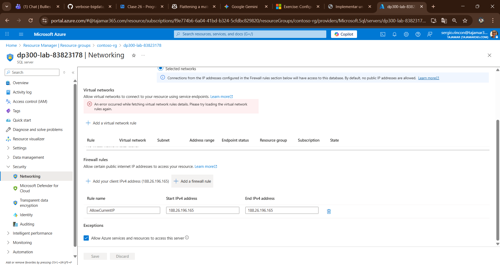
3.  Abre tu servidor (`dp300-lab-xxxxxxxx`).
    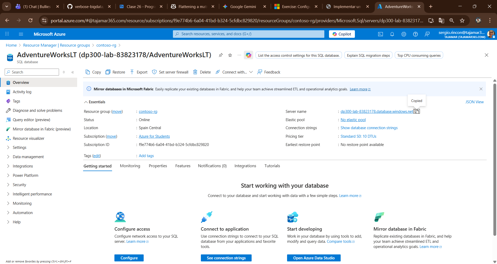
4.  En la página **Información general**, copia el **Nombre del servidor** al portapapeles. Lo necesitarás para SSMS.
5.  En el menú de la izquierda, ve a **Seguridad** y selecciona **Redes**.
6.  Bajo **Reglas de firewall**, comprueba que tu dirección IP esté en la lista.
7.  Si no está, haz clic en **+ Agregar su dirección IPv4 de cliente** y luego en **Guardar**.


### B. Importar la Base de Datos (BACPAC)

1.  Abre **SQL Server Management Studio (SSMS)**.
2.  Conéctate usando los valores que anotaste del script de PowerShell:
    * **Nombre del servidor:** `<Pega el nombre de tu servidor aquí>`
    * **Autenticación:** `Autenticación de SQL Server`
    * **Inicio de sesión:** `Tu login de admin`
    * **Contraseña:** `Tu contraseña de admin`
    * Haz clic en **Conectar**.
        
3.  En el **Explorador de objetos**, haz clic derecho en **Bases de datos** y selecciona **Importar una aplicación de nivel de datos...**.
4.  En el asistente de importación, haz clic en **Siguiente**.
5.  En **Configuración de importación**, haz clic en **Examinar...** y selecciona el archivo `AdventureWorksLT.bacpac` de la carpeta `C:\LabFiles\dp-300-database-administrator\Allfiles\Labs\04`.

6.  En la pantalla **Configuración de la base de datos**, cambia:
    * **Nombre de la base de datos:** `AdventureWorksFromBacpac`
    * **Edición:** `Básica`
    * Haz clic en **Siguiente**.
        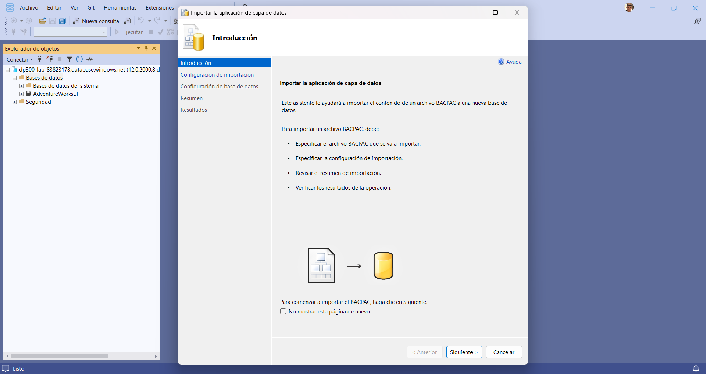
7.  Haz clic en **Finalizar** y espera a que se complete la importación.
    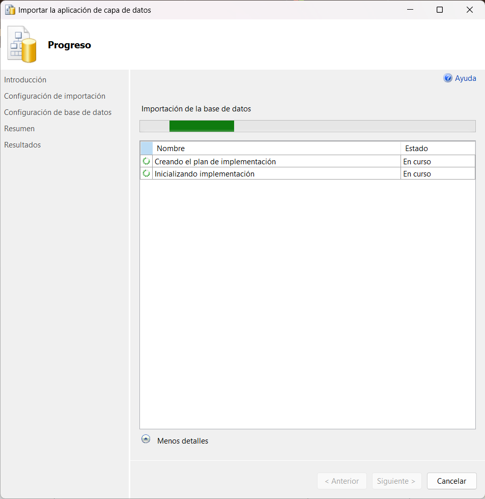
8.  Cuando termine, haz clic en **Cerrar**.
    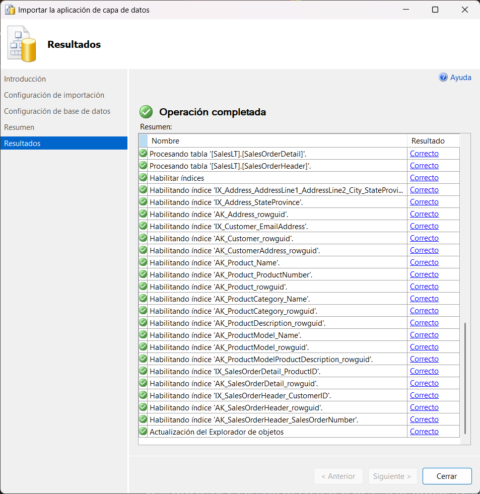

### C. Configurar el Firewall a nivel de Base de Datos

1.  En SSMS, haz clic derecho en tu nueva base de datos `AdventureWorksFromBacpac` y selecciona **Nueva consulta**.
    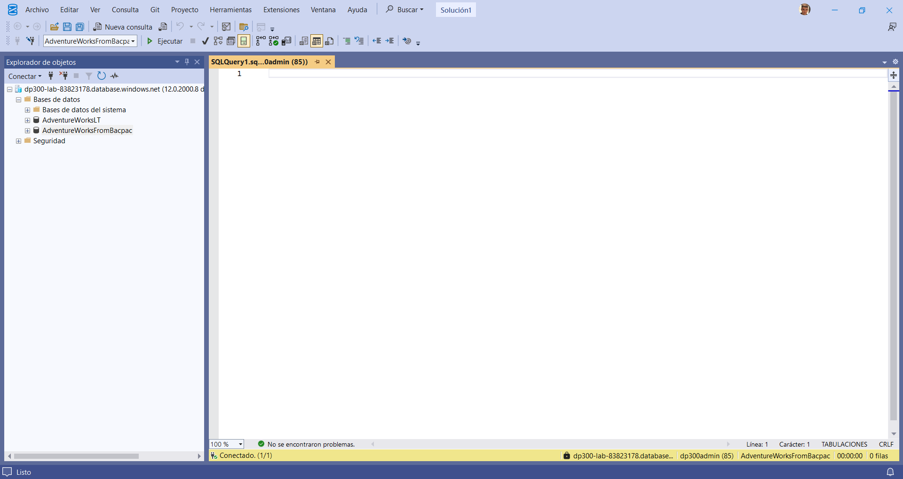
2.  Pega y ejecuta el siguiente T-SQL. **Importante:** Reemplaza `000.000.000.000` con tu propia dirección IP de cliente (la misma que usaste en el portal).

    ```sql
    EXECUTE sp_set_database_firewall_rule 
            @name = N'AWFirewallRule',
            @start_ip_address = '000.000.000.000', 
            @end_ip_address = '000.000.000.000'
    ```

### D. Crear y Probar un Usuario Contenido

1.  En una **Nueva consulta** (asegúrate de que esté conectada a `AdventureWorksFromBacpac`), crea un usuario contenido:

    ```sql
    USE [AdventureWorksFromBacpac]
    GO
    CREATE USER ContainedDemo WITH PASSWORD = 'P@ssw0rd01'
    ```
    > 📝 Un usuario contenido se autentica en la *propia base de datos*, no en el servidor `master`.

2.  Ahora, vamos a probarlo. En el **Explorador de objetos**, haz clic en **Conectar** > **Motor de base de datos**.
    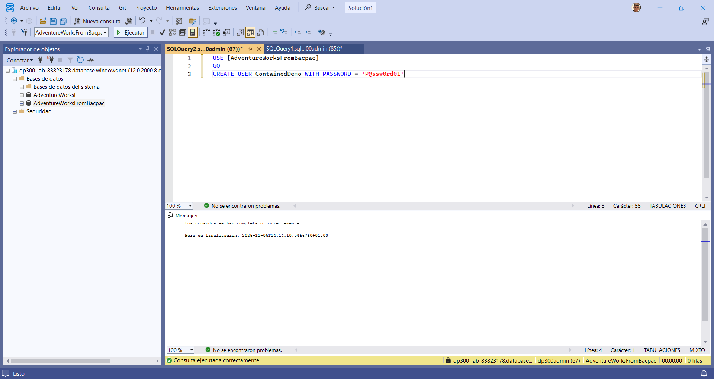
3.  Intenta conectarte con estas credenciales:
    * **Iniciar sesión:** `ContainedDemo`
    * **Contraseña:** `P@ssw0rd01`
    * Haz clic en **Conectar**.
        

4.  **¡FALLARÁ!** Recibirás el error `18456`.
    

    > 📝 **¿Por qué?** Porque SSMS intenta iniciar sesión en la base de datos `master` por defecto, y este usuario no existe allí.

5.  Cierra el error. En el mismo diálogo de conexión, haz clic en **Opciones »**.
    
6.  Ve a la pestaña **Propiedades de conexión**.
7.  En el campo **Conectar a la base de datos**, escribe `AdventureWorksFromBacpac`.
8.  Haz clic en **Conectar**.
    

9.  **¡Éxito!** Ahora estás conectado directamente a esa base de datos como el usuario `ContainedDemo`.
    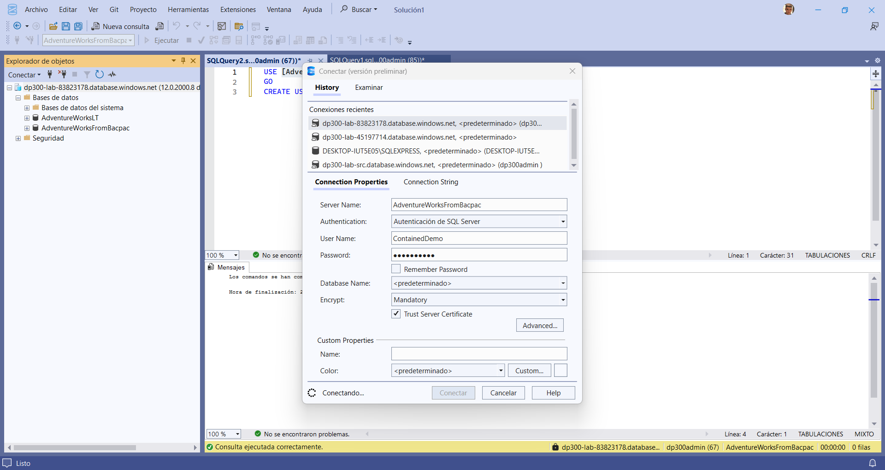

---

## 🧹 4. Recursos de limpieza

No dejes recursos encendidos si no los necesitas.

### Opción A: Eliminar todo el Grupo de Recursos

1.  En el Portal de Azure, ve a **Grupos de recursos**.
    
2.  Selecciona el grupo de recursos que creaste (`contoso-rg` o el tuyo).
    
3.  Haz clic en **Eliminar grupo de recursos**.
    
4.  Escribe el nombre del grupo para confirmar y haz clic en **Eliminar**.
    

### Opción B: Eliminar solo los Recursos del Laboratorio

1.  En el Portal de Azure, ve a tu grupo de recursos.
2.  Selecciona todos los recursos creados por el script (el servidor SQL, la base de datos, etc.).
    
3.  Haz clic en **Eliminar**.
    
4.  Escribe `eliminar` en el cuadro de confirmación y haz clic en **Eliminar**.
    

### Opción C: Eliminar la Carpeta Local

1.  En el Explorador de archivos de tu máquina, ve a la unidad `C:\`.
2.  Haz clic derecho en la carpeta `LabFiles` y selecciona **Eliminar**.
    

---

**¡Has completado el laboratorio!** Has configurado firewalls a nivel de servidor y base de datos, y has probado el acceso con usuarios contenidos.