🔒 Habilitación de la Seguridad (Microsoft Defender)
1. Navegación en el Portal
Abre el Azure Portal y busca SQL servers.

Selecciona tu servidor SQL (dp300-lab-xxxxxxxx).

📸 Captura 1: 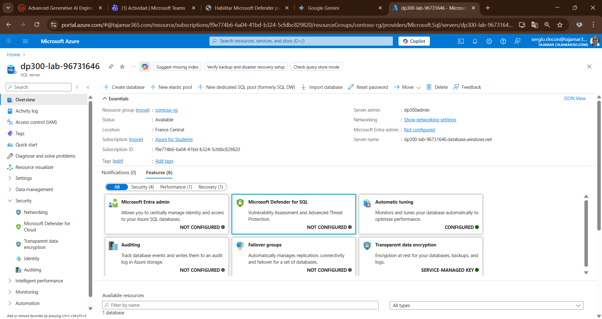

2. Configuración de Defender
En Overview, selecciona Not configured junto a Microsoft Defender for SQL.

Selecciona Enable bajo Microsoft Defender for SQL.

📸 Captura 2: 

🔎 Evaluación de Vulnerabilidades (VA)
1. Ejecutar el Análisis
En tu servidor SQL, ve a SQL databases > AdventureWorksLT.

Navega a Security > Microsoft Defender for Cloud.

Bajo Vulnerability assessment findings, selecciona View additional findings in Vulnerability Assessment.

Selecciona Scan.

📸 Captura 3: 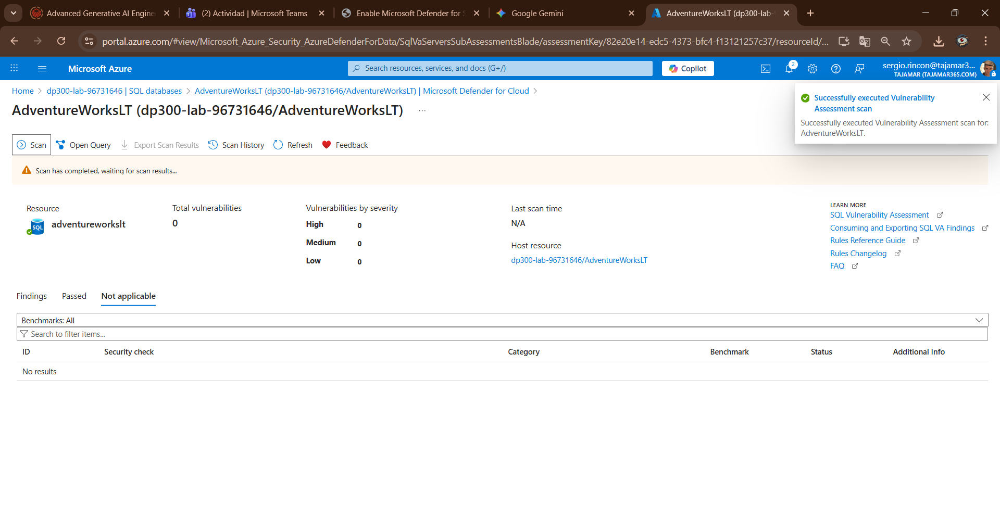

2. Establecer Línea Base (Baseline)
Selecciona una vulnerabilidad (p. ej., VA1143).

Selecciona Add all results as baseline y luego Yes.

Vuelve a ejecutar Scan para confirmar que el resultado es Passed.

📸 Captura 4: 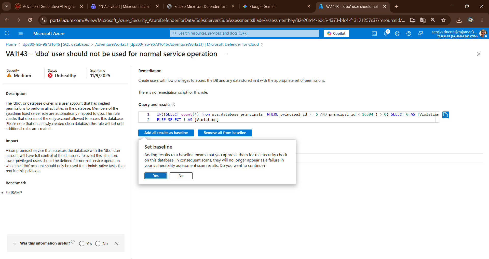
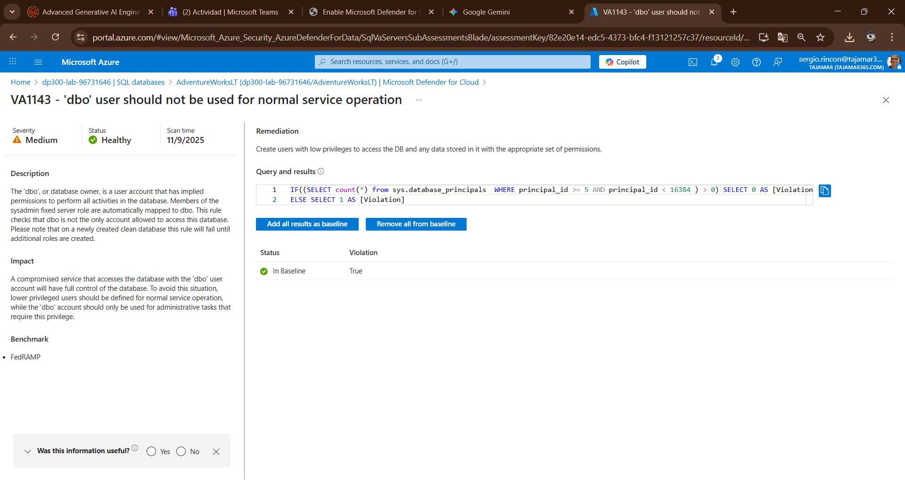
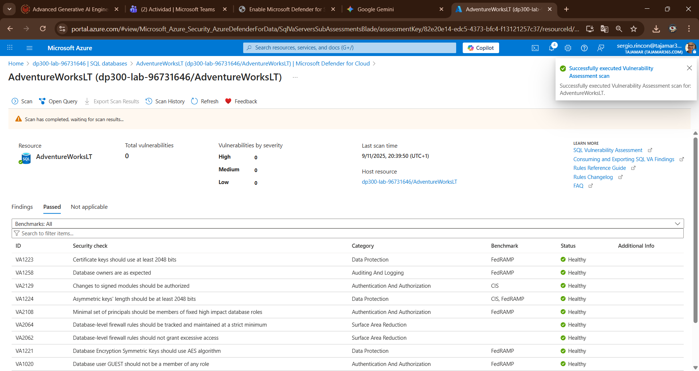

🚨 Advanced Threat Protection (ATP)
1. Simulación de SQL Injection (SSMS)
ATP detectará esta actividad anómala al configurar la conexión.

Abre SSMS y conéctate al servidor SQL de Azure.

En la ventana de conexión, ve a Options » > Connection Properties.

Establece Connect to database como AdventureWorksLT.

En Additional Connection Parameters, inserta:

SQL

Application Name=webappname
📸 Captura 5: 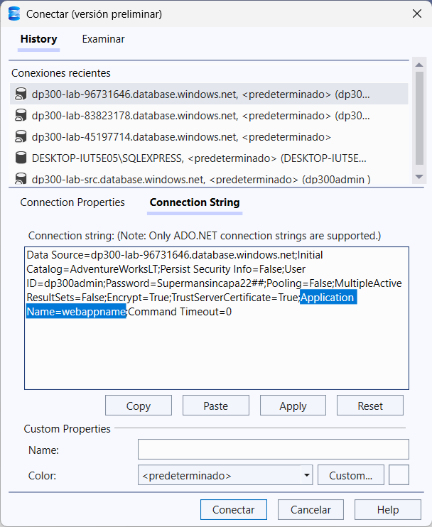

Conecta y ejecuta el exploit de prueba:

SQL

SELECT * FROM sys.databases WHERE database_id like '' or 1 = 1 --' and family = 'test1';
2. Revisión de Alerta en el Portal
En el Portal, ve a AdventureWorksLT > Security > Microsoft Defender for Cloud.

Selecciona Check for alerts on this resources in Microsoft Defender for Cloud.

Selecciona la alerta Potential SQL injection.

Revisa los detalles de la alerta (Declaración Vulnerable y Aplicación Cliente).

📸 Captura 6: 
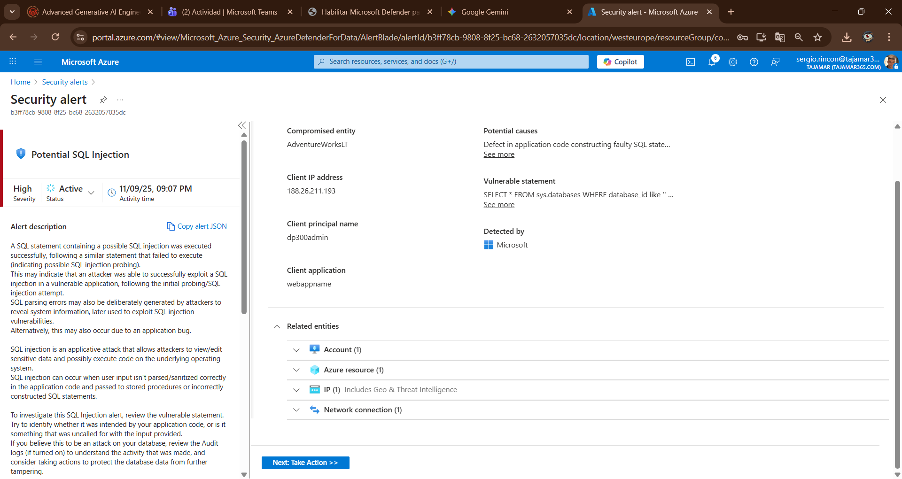

🏷️ Clasificación de Datos (Data Discovery)
1. Aplicar Recomendaciones Automáticas
En la base de datos AdventureWorksLT, ve a Security > Data Discovery & Classification.

Selecciona el enlace que indica el número de columnas con recomendaciones.

Marca Select all, selecciona Accepted selected recommendations y luego Save.

📸 Captura 7: 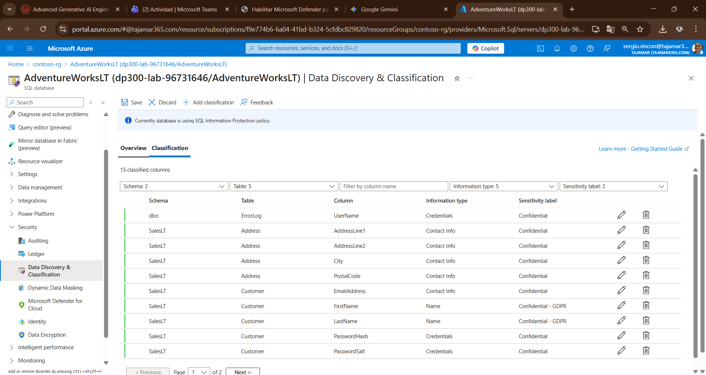

2. Clasificación Manual
Añade manualmente la clasificación para la columna MiddleName (SalesLT.Customer):

Information type: Name

Sensitivity label: Confidential - GDPR

📸 Captura 7-1: 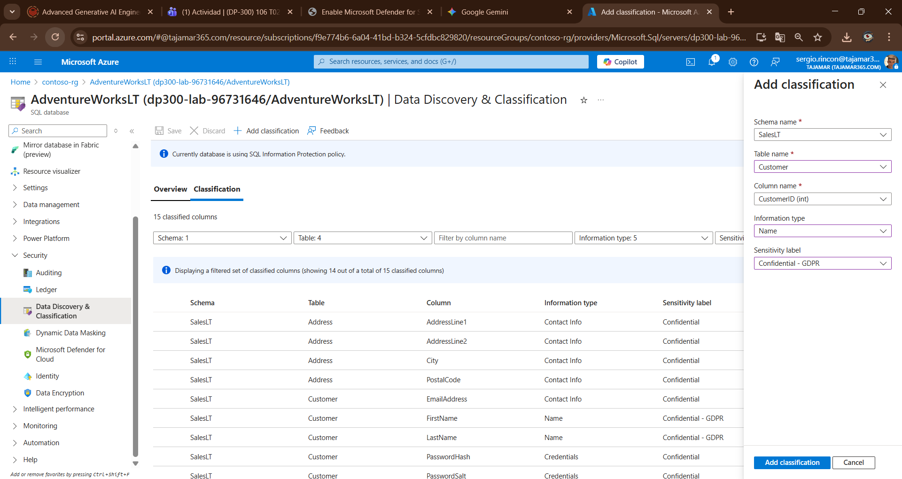

🎭 Dynamic Data Masking (DDM)
1. Aplicación de Máscaras
En la base de datos AdventureWorksLT, ve a Security > Dynamic Data Masking.

Selecciona Add mask.

Crea tres reglas para la tabla SalesLT.Customer: FirstName, MiddleName y LastName.

📸 Captura 8: 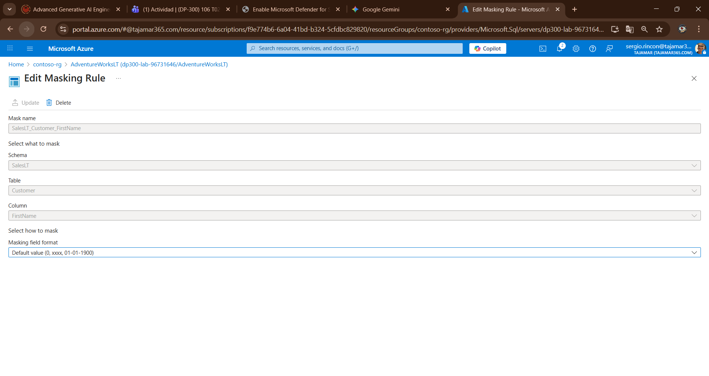

Selecciona Save.

2. Prueba de Enmascaramiento (Usuario Bob)
Crea un nuevo usuario de SQL (Bob) y otórgale permisos de lectura/escritura.

SQL

CREATE USER Bob WITH PASSWORD = 'c0mpl3xPassword!';
ALTER ROLE db_datareader ADD MEMBER Bob;
ALTER ROLE db_datawriter ADD MEMBER Bob;
Ejecuta la consulta de prueba como Bob:

SQL

EXECUTE AS USER = 'Bob';
SELECT TOP 10 FirstName, MiddleName, LastName FROM SalesLT.Customer;
REVERT;
📸 Captura 9: 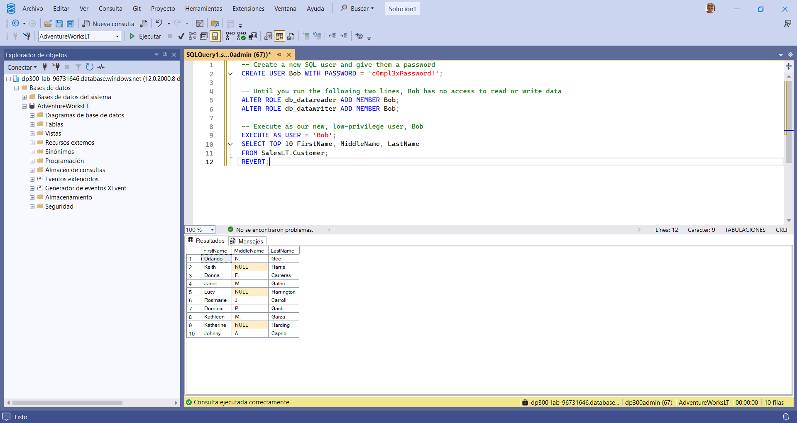

Otorga y revoca el permiso UNMASK para confirmar el control de acceso:

SQL

GRANT UNMASK TO Bob; -- Muestra datos completos
EXECUTE AS USER = 'Bob';
SELECT TOP 10 FirstName, MiddleName, LastName FROM SalesLT.Customer;
REVERT;

REVOKE UNMASK TO Bob; -- Vuelve al enmascaramiento
EXECUTE AS USER = 'Bob';
SELECT TOP 10 FirstName, MiddleName, LastName FROM SalesLT.Customer;
REVERT;
📸 Captura 10: 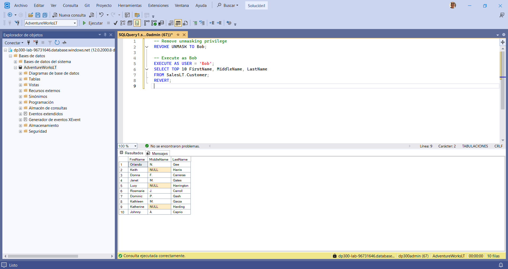

🗑️ Limpieza de Recursos
Elimina todos los recursos creados para evitar costos.

Opción A (Recomendada): Elimina el Resource Group (contoso-rg) completo en el Azure Portal.

Opción B: Elimina los recursos individuales (servidor SQL y DB) si usaste un grupo existente.

Elimina la carpeta C:\LabFiles.

✅ ¡El laboratorio ha concluido exitosamente!