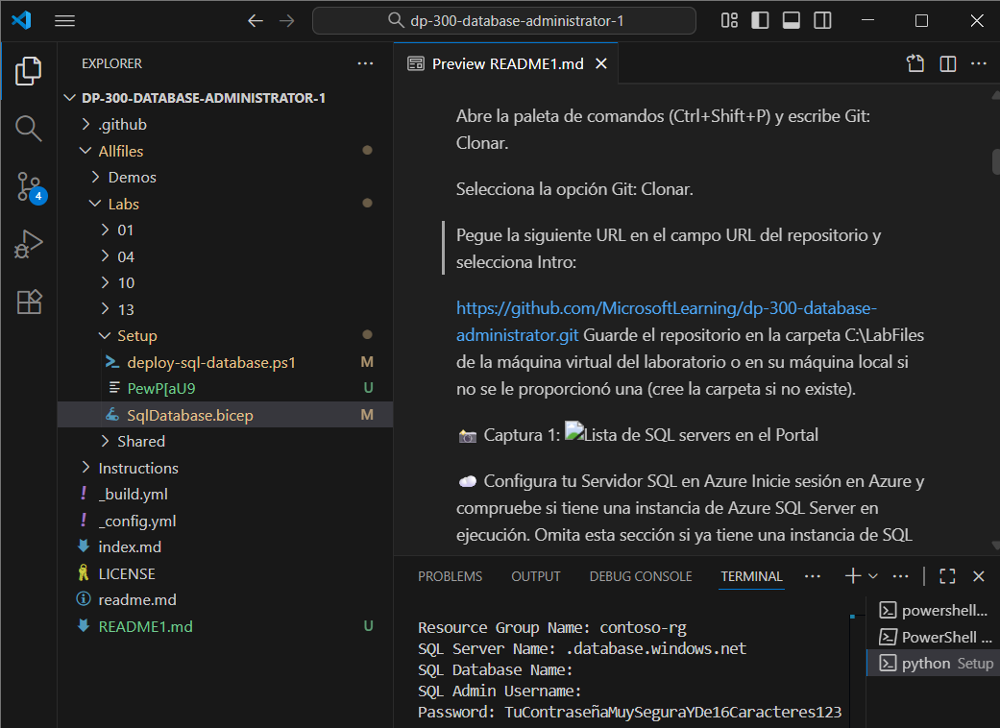
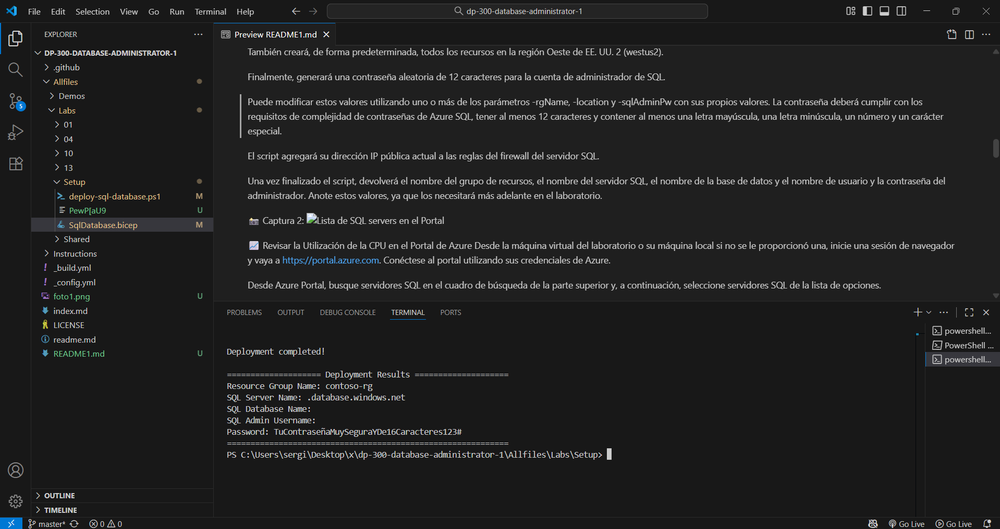
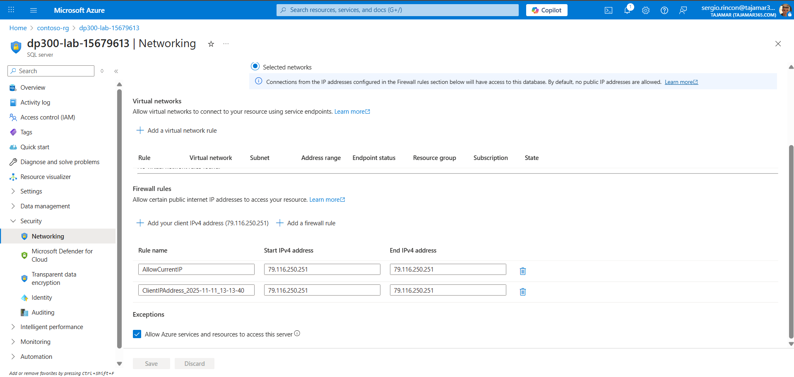
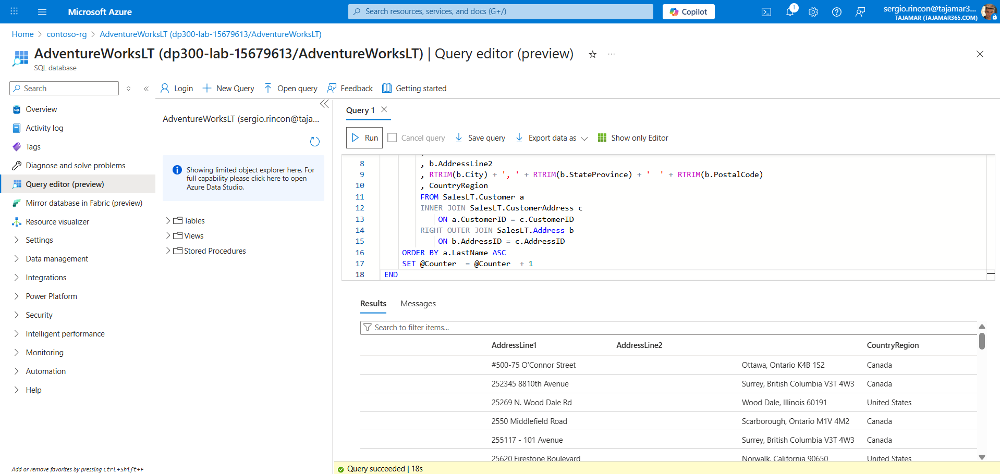
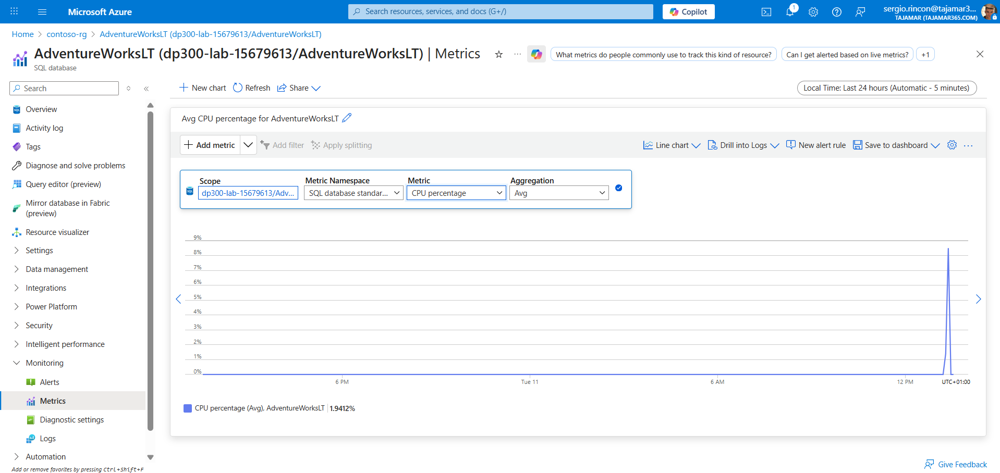
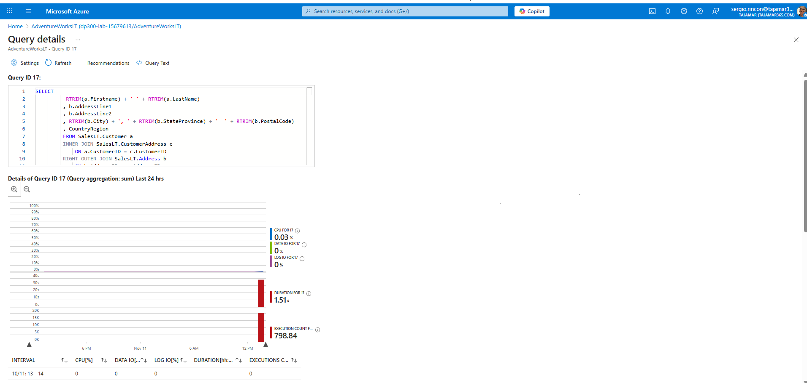
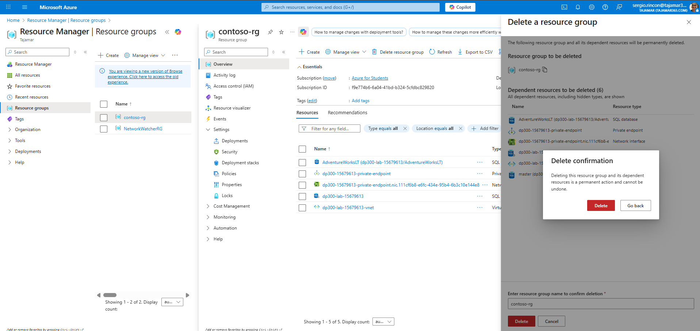

📊 Aísle los Problemas de Rendimiento mediante la Monitorización
Tiempo estimado: 30 minutos

Los estudiantes utilizarán la información obtenida en las lecciones para definir los entregables de un proyecto de transformación digital dentro de AdventureWorksLT. Analizando el portal de Azure y otras herramientas, determinarán cómo utilizarlas para identificar y resolver problemas de rendimiento.

Has sido contratado como administrador de bases de datos para identificar problemas de rendimiento y proporcionar soluciones viables. Debes usar el portal de Azure para identificar dichos problemas y sugerir métodos para resolverlos.

📝 Nota: Estos ejercicios le piden que copie y pegue código T-SQL y utilizan recursos SQL existentes. Verifique que el código se haya copiado correctamente antes de ejecutarlo.

🛠️ Entorno de Configuración
Si ya se le proporcionó y configuró la máquina virtual del laboratorio, encontrará los archivos en la carpeta C:\LabFiles. Compruebe que los archivos estén ahí; si es así, omita esta sección. Sin embargo, si usa su propia máquina o si faltan los archivos, deberá clonarlos desde GitHub para continuar.

Desde la máquina virtual del laboratorio o desde tu máquina local si no se te proporcionó una, inicia una sesión de Visual Studio Code.

Abre la paleta de comandos (Ctrl+Shift+P) y escribe Git: Clonar.

Selecciona la opción Git: Clonar.

Pegue la siguiente URL en el campo URL del repositorio y selecciona Intro:

https://github.com/MicrosoftLearning/dp-300-database-administrator.git
Guarde el repositorio en la carpeta C:\LabFiles de la máquina virtual del laboratorio o en su máquina local si no se le proporcionó una (cree la carpeta si no existe).

📸 Captura 1: 

☁️ Configura tu Servidor SQL en Azure
Inicie sesión en Azure y compruebe si tiene una instancia de Azure SQL Server en ejecución. Omita esta sección si ya tiene una instancia de SQL Server en ejecución en Azure.

Desde la máquina virtual del laboratorio o su máquina local si no se le proporcionó una, inicie una sesión de Visual Studio Code y navegue hasta el repositorio clonado de la sección anterior.

Haz clic con el botón derecho en la carpeta /Allfiles/Labs y selecciona Abrir en la terminal integrada.

Conectémonos a Azure usando la CLI de Azure. Escriba el siguiente comando y seleccione Intro:

az login
📝 Nota: Tenga en cuenta que se abrirá una ventana del navegador. Usa tus credenciales de Azure para iniciar sesión.

Una vez que haya iniciado sesión en Azure, cree un grupo de recursos (si aún no existe) y, dentro de ese grupo, cree un servidor SQL y una base de datos. Escriba el siguiente comando y pulse Intro. El script tardará unos minutos en completarse.

cd ./Setup
./deploy-sql-database.ps1
📝 Nota:

De forma predeterminada, este script creará un grupo de recursos llamado contoso-rg o utilizará un recurso cuyo nombre comience con contoso-rg, si existe.

También creará, de forma predeterminada, todos los recursos en la región Oeste de EE. UU. 2 (westus2).

Finalmente, generará una contraseña aleatoria de 12 caracteres para la cuenta de administrador de SQL.

Puede modificar estos valores utilizando uno o más de los parámetros -rgName, -location y -sqlAdminPw con sus propios valores. La contraseña deberá cumplir con los requisitos de complejidad de contraseñas de Azure SQL, tener al menos 12 caracteres y contener al menos una letra mayúscula, una letra minúscula, un número y un carácter especial.

El script agregará su dirección IP pública actual a las reglas del firewall del servidor SQL.

Una vez finalizado el script, devolverá el nombre del grupo de recursos, el nombre del servidor SQL, el nombre de la base de datos y el nombre de usuario y la contraseña del administrador. Anote estos valores, ya que los necesitará más adelante en el laboratorio.

📸 Captura 2: 

📈 Revisar la Utilización de la CPU en el Portal de Azure
Desde la máquina virtual del laboratorio o su máquina local si no se le proporcionó una, inicie una sesión de navegador y vaya a https://portal.azure.com. Conéctese al portal utilizando sus credenciales de Azure.

Desde Azure Portal, busque servidores SQL en el cuadro de búsqueda de la parte superior y, a continuación, seleccione servidores SQL de la lista de opciones.

Seleccione el servidor SQL dp300-lab-xxxxxxxx, donde xxxxxxxx es una cadena numérica aleatoria.

📝 Nota: Si está utilizando su propio servidor Azure SQL no creado por este laboratorio, seleccione el nombre de ese servidor SQL.

En la página principal del servidor SQL de Azure, en Seguridad, seleccione Redes.

En la página de Redes, verifique si su IP pública actual ya está agregada a la lista de reglas del Firewall; si no lo está, seleccione + Agregar su dirección IPv4 de cliente (su dirección IP) para agregarla y luego seleccione Guardar.

📸 Captura 3:

Desde la hoja principal de su servidor Azure SQL, vaya a la sección Configuración, seleccione Bases de datos SQL y, a continuación, seleccione la base de datos AdventureWorksLT.

En el panel de navegación izquierdo, seleccione Editor de consultas (vista previa).

📝 Nota: Esta función está en versión preliminar.

Seleccione el nombre de usuario administrador de SQL Server e introduzca la contraseña o sus credenciales de Microsoft Entra si se le han asignado para conectarse a la base de datos.

Nombre del servidor: < pegue aquí el nombre de su servidor de Azure SQL Database >

Autenticación: Autenticación de SQL Server

Inicio de sesión del administrador del servidor: Su inicio de sesión de administrador del servidor de Azure SQL Database

Contraseña: Su contraseña de administrador del servidor de Azure SQL Database

En la Consulta 1, escriba la siguiente consulta y seleccione Ejecutar:

SQL

DECLARE @Counter INT 
SET @Counter=1
WHILE ( @Counter <= 10000)
BEGIN
    SELECT 
         RTRIM(a.Firstname) + ' ' + RTRIM(a.LastName)
        , b.AddressLine1
        , b.AddressLine2
        , RTRIM(b.City) + ', ' + RTRIM(b.StateProvince) + '  ' + RTRIM(b.PostalCode)
        , CountryRegion
        FROM SalesLT.Customer a
        INNER JOIN SalesLT.CustomerAddress c 
            ON a.CustomerID = c.CustomerID
        RIGHT OUTER JOIN SalesLT.Address b
            ON b.AddressID = c.AddressID
    ORDER BY a.LastName ASC
    SET @Counter  = @Counter  + 1
END
Espere a que finalice la consulta.

Vuelva a ejecutar la consulta dos veces más para generar cierta carga de CPU en la base de datos.

📸 Captura 3-1:

En la hoja de la base de datos AdventureWorksLT, seleccione el icono Métricas en la sección Monitoreo. Si aparece el mensaje "Se descartarán los cambios no guardados", seleccione Aceptar.

Cambie la opción del menú Métrica para que refleje el Porcentaje de CPU y, a continuación, seleccione una Agregación de Promedio. Esto mostrará el porcentaje promedio de CPU para el período de tiempo dado.

Observe el promedio de uso de la CPU a lo largo del tiempo. Debería notar un pico en la utilización de la CPU al final del gráfico, cuando se estaba ejecutando la consulta.

📸 Captura 4:

🔍 Identificar Consultas que Consumen Muchos Recursos de CPU
Ubique el icono de Información sobre el rendimiento de las consultas en la sección Rendimiento inteligente del panel de la base de datos AdventureWorksLT.

Seleccione Restablecer configuración.

Seleccione la consulta en la cuadrícula debajo del gráfico. Si no ve la consulta que ejecutamos varias veces anteriormente, espere de 2 a 5 minutos y seleccione Actualizar.

📝 Nota: Si aparece más de una consulta, selecciónelas todas para ver los resultados. Observe la gran cantidad de información disponible para cada una.

En cuanto a la consulta que ejecutaste anteriormente, ten en cuenta que la duración total fue de más de un minuto y que se ejecutó alrededor de treinta mil veces.

Al revisar el texto SQL en la página de detalles de la consulta y compararlo con la consulta que ejecutó, observará que los detalles de la consulta solo incluyen la instrucción SELECT y no el bucle WHILE ni otras instrucciones. Esto se debe a que Query Performance Insight se basa en los datos del Almacén de consultas, que solo registra las instrucciones del Lenguaje de manipulación de datos (DML), como SELECT, INSERT, UPDATE, DELETE, MERGE y BULK INSERT, e ignora las instrucciones del Lenguaje de definición de datos (DDL).

📸 Captura 5:

Conclusión: No todos los problemas de rendimiento se deben a un alto uso de la CPU por la ejecución de una sola consulta. En este caso, la consulta se ejecutó miles de veces, lo que también puede generar un alto uso de la CPU.

🧹 Recursos de Limpieza
Si no está utilizando Azure SQL Server para ningún otro propósito, puede eliminar los recursos que creó en este laboratorio.

Eliminar el Grupo de Recursos
Si creó un nuevo grupo de recursos para este laboratorio, puede eliminar el grupo de recursos para eliminar todos los recursos creados en este laboratorio.

En Azure Portal, seleccione Grupos de recursos en el panel de navegación izquierdo o busque Grupos de recursos en la barra de búsqueda y selecciónelo en los resultados.

Acceda al grupo de recursos que creó para este laboratorio. El grupo de recursos contendrá el servidor Azure SQL y otros recursos creados en este laboratorio.

Seleccione Eliminar grupo de recursos en el menú superior.

En el cuadro de diálogo Eliminar grupo de recursos, escriba el nombre del grupo de recursos para confirmar y seleccione Eliminar.

Espere a que se elimine el grupo de recursos.

Cierra el portal de Azure.

📸 Captura 6:

Eliminar Solo los Recursos del Laboratorio
Si no creó un nuevo grupo de recursos para este laboratorio y desea dejar intacto el grupo de recursos y sus recursos anteriores, aún puede eliminar los recursos creados en este laboratorio.

En Azure Portal, seleccione Grupos de recursos en el panel de navegación izquierdo o busque Grupos de recursos en la barra de búsqueda y selecciónelo en los resultados.

Acceda al grupo de recursos que creó para este laboratorio. El grupo de recursos contendrá el servidor Azure SQL y otros recursos creados en este laboratorio.

Seleccione todos los recursos que tengan como prefijo el nombre del servidor SQL que especificó previamente en el laboratorio.

Seleccione Eliminar en el menú superior.

En el cuadro de diálogo Eliminar recursos, escriba eliminar y seleccione Eliminar.

Seleccione Eliminar nuevamente para confirmar la eliminación de los recursos.

Espere a que se eliminen los recursos.

Cierra el portal de Azure.

Eliminar la Carpeta LabFiles
Si creaste una nueva carpeta LabFiles para este laboratorio y ya no la necesitas, puedes eliminar la carpeta LabFiles para borrar todos los archivos creados en este laboratorio.

Desde la máquina virtual del laboratorio o su máquina local si no se le proporcionó una, abra el explorador de archivos y navegue hasta la unidad C:\.

Haz clic con el botón derecho en la carpeta LabFiles y selecciona Eliminar.

Seleccione Sí para confirmar la eliminación de la carpeta.

¡Has completado satisfactoriamente este laboratorio!