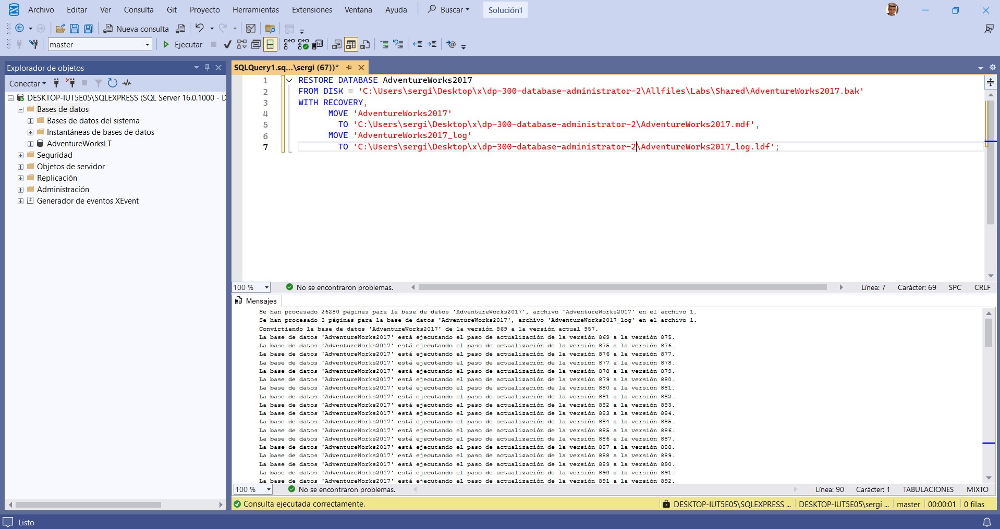
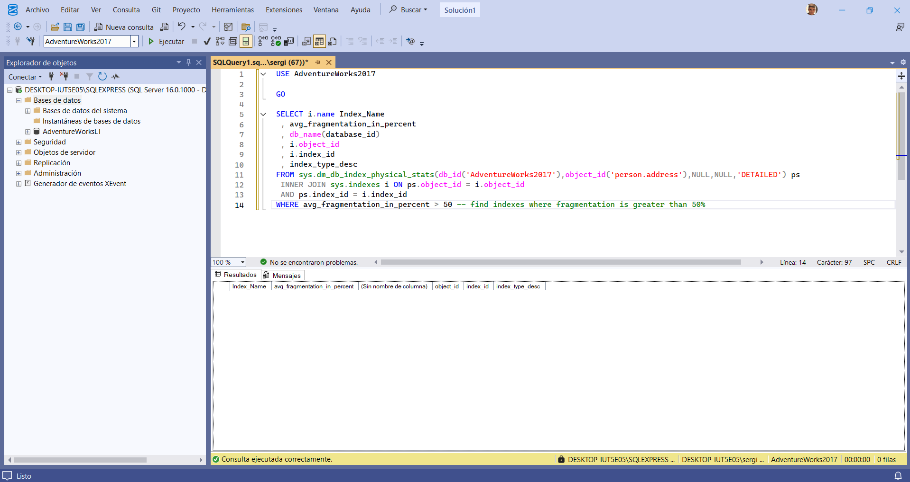
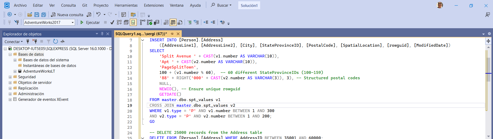
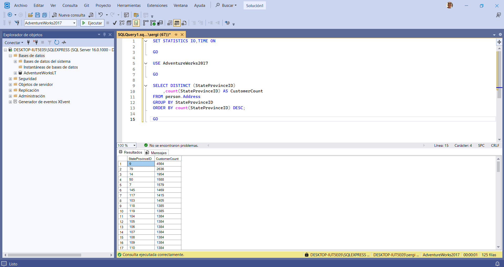
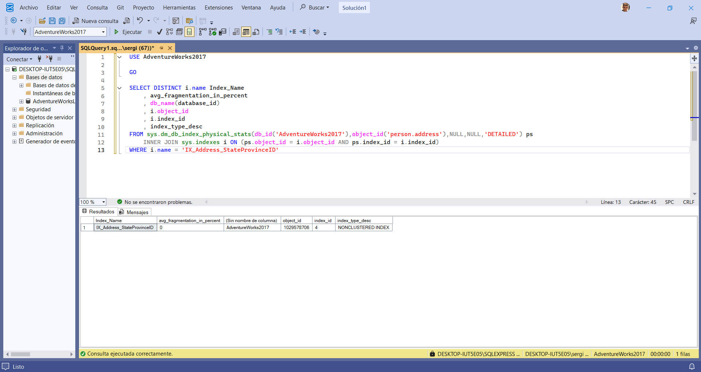
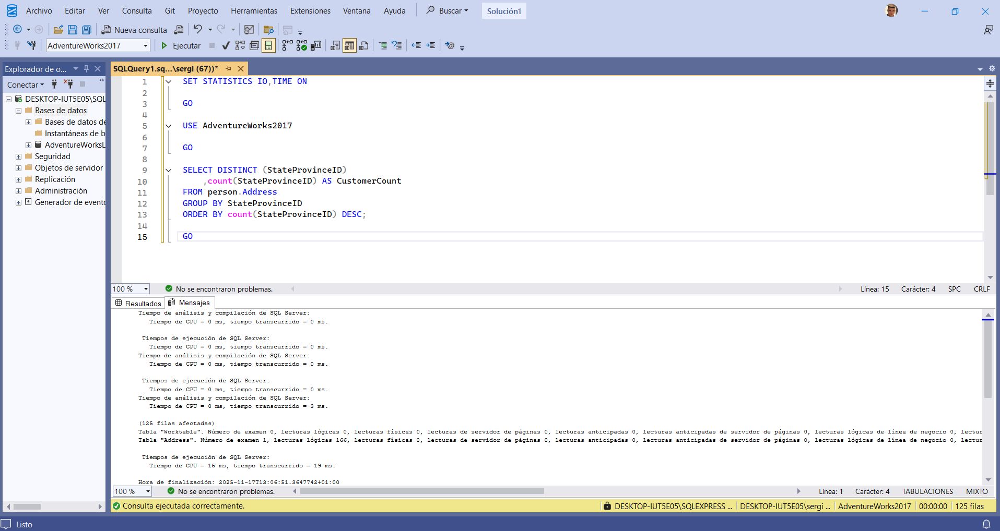
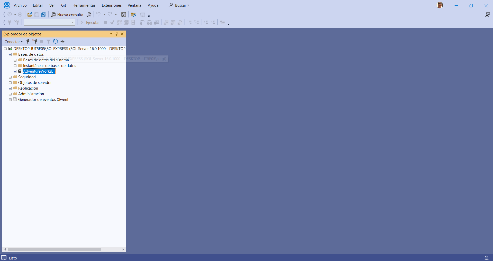

📈 LAB 10: Aislamiento de Problemas de Rendimiento (Fragmentación)
🎯 Objetivo
Identificar y resolver problemas de rendimiento causados por la fragmentación de índices en SQL Server, utilizando T-SQL y Vistas de Gestión Dinámica (DMVs) para analizar las lecturas lógicas y el impacto de la reconstrucción de índices.

💼 Rol
Administrador de Bases de Datos.

I. Configuración del Entorno
1. Clonar el Repositorio Base (Si es necesario)
Se clona el repositorio de Microsoft Learning para obtener los archivos necesarios, incluyendo el .bak de la base de datos.

PowerShell

git clone https://github.com/MicrosoftLearning/dp-300-database-administrator.git
# Guardado en C:\LabFiles
2. Restaurar la Base de Datos AdventureWorks2017
Se restaura la base de datos AdventureWorks2017.bak en la instancia local de SQL Server usando SSMS.

SQL

RESTORE DATABASE AdventureWorks2017
FROM DISK = 'C:\LabFiles\dp-300-database-administrator\Allfiles\Labs\Shared\AdventureWorks2017.bak'
WITH RECOVERY,
      MOVE 'AdventureWorks2017' 
        TO 'C:\LabFiles\AdventureWorks2017.mdf',
      MOVE 'AdventureWorks2017_log'
        TO 'C:\LabFiles\AdventureWorks2017_log.ldf';

📸 Captura 1:

II. Investigación de la Fragmentación del Índice
1. Revisión Inicial de Fragmentación
Se ejecuta una consulta contra la DMV sys.dm_db_index_physical_stats para buscar índices en Person.Address con más del 50% de fragmentación.

SQL

USE AdventureWorks2017
GO
    
SELECT i.name Index_Name, avg_fragmentation_in_percent
FROM sys.dm_db_index_physical_stats(db_id('AdventureWorks2017'),object_id('person.address'),NULL,NULL,'DETAILED') ps
 INNER JOIN sys.indexes i ON ps.object_id = i.object_id 
 AND ps.index_id = i.index_id
WHERE avg_fragmentation_in_percent > 50
Resultado: La consulta inicial no devuelve ningún resultado.

📸 Captura 2:

2. Simulación de Carga (Generación de Fragmentación)
Para simular una carga de trabajo pesada que causa divisiones de página y fragmentación, se insertan y eliminan una gran cantidad de registros.

SQL

USE AdventureWorks2017
GO
    
-- Insertar 60,000 registros
INSERT INTO [Person].[Address] (...)
SELECT ...
FROM master.dbo.spt_values v1
CROSS JOIN master.dbo.spt_values v2
WHERE v1.type = 'P' AND v1.number BETWEEN 1 AND 300 
AND v2.type = 'P' AND v2.number BETWEEN 1 AND 200;
GO
    
-- Borrar 25,000 registros
DELETE FROM [Person].[Address] WHERE AddressID BETWEEN 35001 AND 60000;
GO

-- Insertar 40,000 registros
INSERT INTO [Person].[Address] (...)
SELECT ...
FROM master.dbo.spt_values v1
CROSS JOIN master.dbo.spt_values v2
WHERE v1.type = 'P' AND v1.number BETWEEN 1 AND 200 
AND v2.type = 'P' AND v2.number BETWEEN 1 AND 200;
GO
3. Verificación de Fragmentación (Post-Carga)
Se ejecuta nuevamente la consulta de sys.dm_db_index_physical_stats.

Resultado: Ahora se observan cuatro índices altamente fragmentados.

📸 Captura 3:

4. Medición del Costo (Lecturas Lógicas)
Se mide el costo de una consulta analítica sobre la tabla fragmentada usando SET STATISTICS IO,TIME ON.

SQL

SET STATISTICS IO,TIME ON
GO
USE AdventureWorks2017
GO
    
SELECT DISTINCT (StateProvinceID), count(StateProvinceID) AS CustomerCount
FROM person.Address
GROUP BY StateProvinceID
ORDER BY count(StateProvinceID) DESC;
GO
Resultado (Pestaña Mensajes): Se anota el número de lecturas lógicas (logical reads).

📸 Captura 4:

III. Resolución de la Fragmentación
1. Reconstrucción del Índice
Se reconstruye el índice específico (IX_Address_StateProvinceID).

SQL

USE AdventureWorks2017
GO
    
ALTER INDEX [IX_Address_StateProvinceID] ON [Person].[Address] REBUILD PARTITION = ALL 
WITH ( ONLINE = OFF )
2. Verificación de Fragmentación (Post-Reconstrucción)
Se ejecuta la consulta de sys.dm_db_index_physical_stats por tercera vez.

SQL

USE AdventureWorks2017
GO
    
SELECT DISTINCT i.name Index_Name, avg_fragmentation_in_percent
FROM ...
WHERE i.name = 'IX_Address_StateProvinceID'
Resultado: La fragmentación se ha reducido a 0%.

📸 Captura 5:

3. Medición del Costo (Post-Reconstrucción)
Se vuelve a ejecutar la consulta analítica (Paso 4) con SET STATISTICS IO,TIME ON.

SQL

SET STATISTICS IO,TIME ON
GO
USE AdventureWorks2017
GO
    
SELECT DISTINCT (StateProvinceID), count(StateProvinceID) AS CustomerCount
FROM person.Address
...
GO
Resultado (Pestaña Mensajes): Se observa una reducción significativa en el número de lecturas lógicas.

📸 Captura 6:

IV. Conclusión
El mantenimiento del índice (reconstrucción) ha demostrado tener un impacto directo y positivo en el rendimiento de las consultas, reduciendo las lecturas lógicas necesarias.

V. Limpieza
Se eliminan los archivos de laboratorio y la base de datos AdventureWorks2017 de la instancia de SQL Server.

📸 Captura 7: