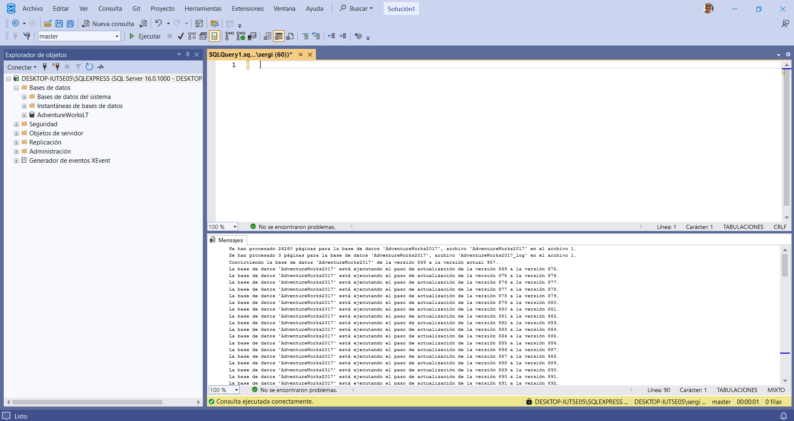
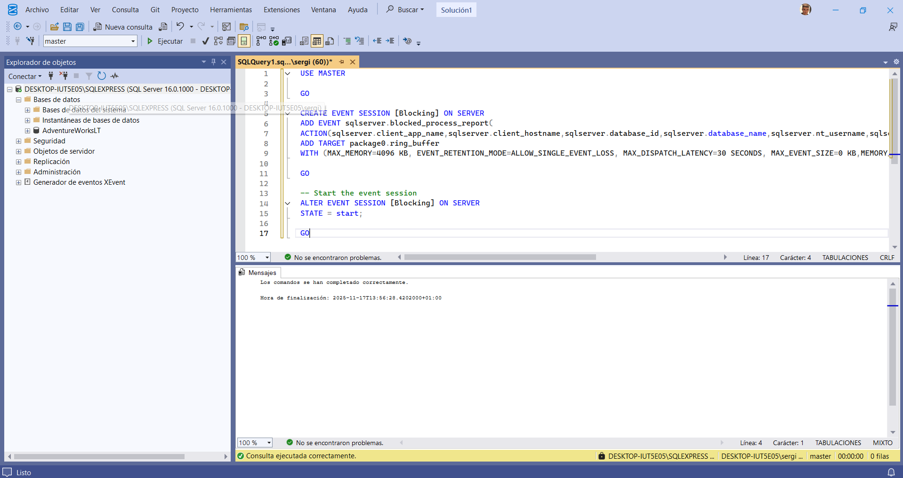
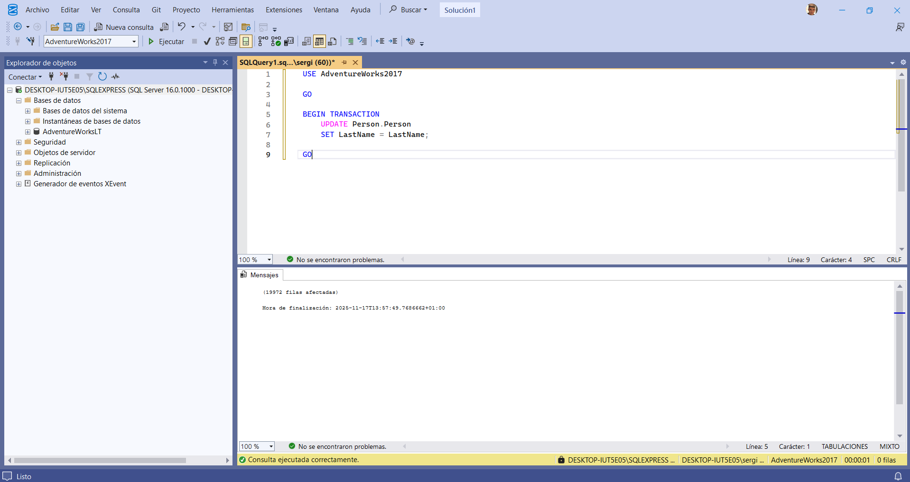
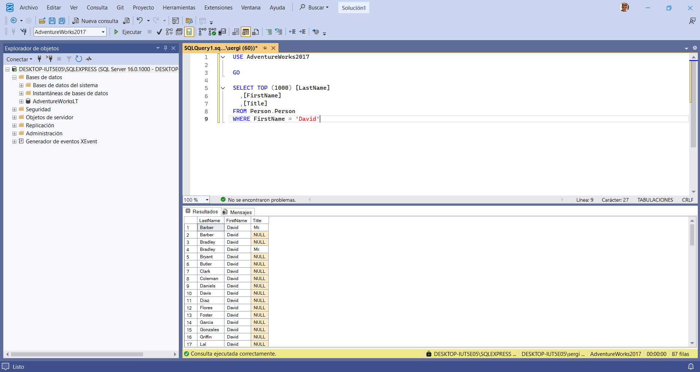
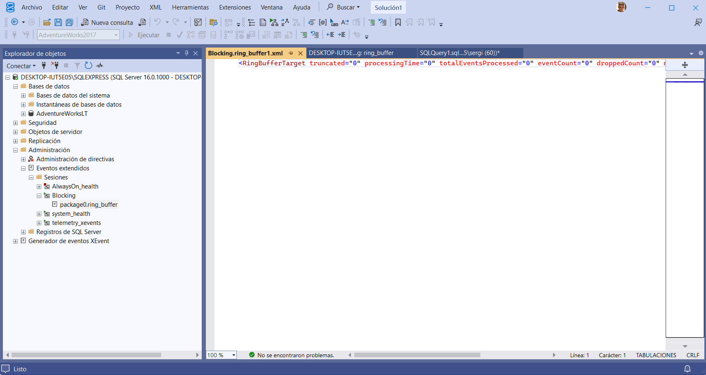
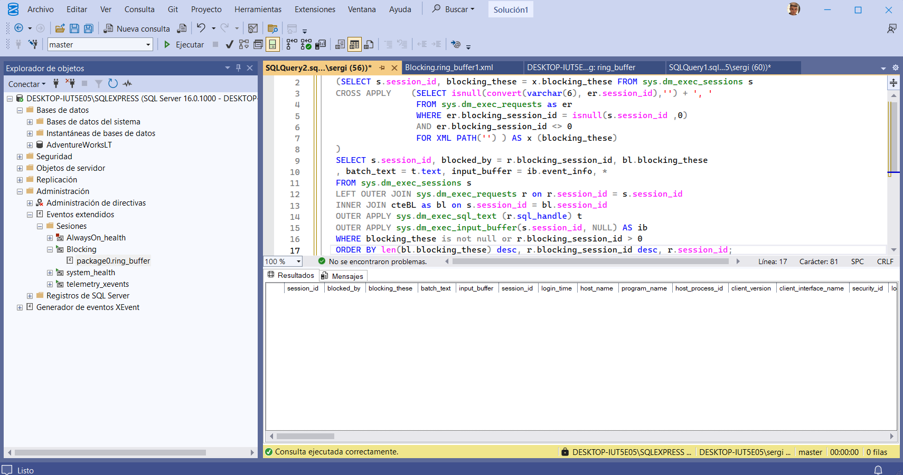
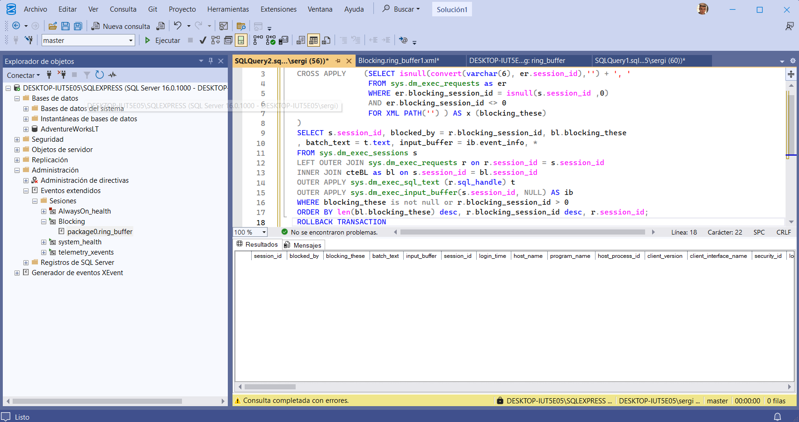
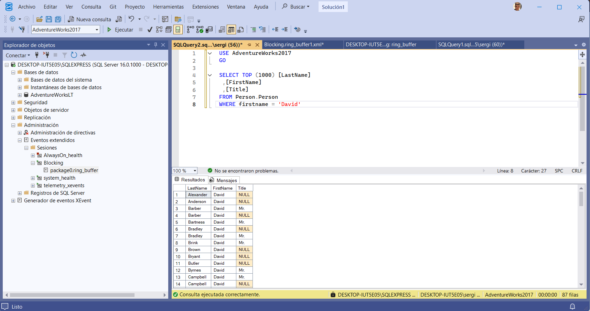

⛓️ LAB 08: Identificación y Resolución de Problemas de Bloqueo
🎯 Objetivo
Identificar y resolver problemas de rendimiento causados por bloqueos de transacciones (blocking) en SQL Server. Se utilizarán Extended Events (Eventos Extendidos) y Vistas de Gestión Dinámica (DMVs) para diagnosticar el bloqueo y se implementará Read Committed Snapshot Isolation (RCSI) como solución.

💼 Rol
Administrador de Bases de Datos.

I. Configuración del Entorno y Base de Datos
1. Clonar el Repositorio Base (Si es necesario)
Se clona el repositorio de Microsoft Learning para obtener los archivos necesarios, incluyendo el .bak de la base de datos.

PowerShell

git clone https://github.com/MicrosoftLearning/dp-300-database-administrator.git
# Guardado en C:\LabFiles (o la ruta local)
2. Restaurar la Base de Datos AdventureWorks2017
Se restaura la base de datos AdventureWorks2017.bak en la instancia local de SQL Server usando SSMS.

SQL

RESTORE DATABASE AdventureWorks2017
FROM DISK = 'C:\LabFiles\dp-300-database-administrator\Allfiles\Labs\Shared\AdventureWorks2017.bak'
WITH RECOVERY,
      MOVE 'AdventureWorks2017' 
        TO 'C:\LabFiles\AdventureWorks2017.mdf',
      MOVE 'AdventureWorks2017_log'
        TO 'C:\LabFiles\AdventureWorks2017_log.ldf';
(Nota: Las rutas deben ajustarse a la ubicación real de los archivos).

📸 Captura 1:

II. Creación de un Evento Extendido (XEvent) para Bloqueos
1. Crear la Sesión de Eventos
Se crea una sesión de Eventos Extendidos ([Blocking]) para capturar informes de procesos bloqueados (blocked_process_report).

SQL

USE MASTER
GO

CREATE EVENT SESSION [Blocking] ON SERVER 
ADD EVENT sqlserver.blocked_process_report(
    ACTION(sqlserver.client_app_name, sqlserver.client_hostname, sqlserver.database_id, 
           sqlserver.database_name, sqlserver.nt_username, sqlserver.session_id, 
           sqlserver.sql_text, sqlserver.username))
ADD TARGET package0.ring_buffer
WITH (MAX_MEMORY=4096 KB, STARTUP_STATE=ON);
GO

-- Iniciar la sesión
ALTER EVENT SESSION [Blocking] ON SERVER 
STATE = start;
GO
2. Configurar el Umbral de Bloqueo
Se reduce el umbral (blocked process threshold) a 60 segundos para que el informe se genere más rápido.

SQL

EXEC sys.sp_configure N'show advanced options', 1;
RECONFIGURE WITH OVERRIDE;
GO
EXEC sp_configure 'blocked process threshold (s)', 60;
RECONFIGURE WITH OVERRIDE;
GO
III. Simulación y Diagnóstico del Bloqueo
1. Simular la Transacción de Bloqueo (Query 1)
En una Nueva Ventana de Consulta (Query 1), se inicia una transacción que actualiza Person.Person y se deja abierta (sin COMMIT o ROLLBACK).

SQL

USE AdventureWorks2017
GO

BEGIN TRANSACTION
    UPDATE Person.Person 
    SET LastName = LastName;
GO
Resultado: Esta consulta toma un bloqueo (lock) sobre la tabla y espera.

📸 Captura 2:
📸 Captura 2-1:

2. Simular la Consulta Bloqueada (Query 2)
En una Segunda Ventana de Consulta (Query 2), se ejecuta una consulta SELECT sobre la misma tabla.

SQL

USE AdventureWorks2017
GO

SELECT TOP (1000) [LastName], [FirstName], [Title]
FROM Person.Person
WHERE FirstName = 'David'
Resultado: Esta consulta se queda "colgada", esperando indefinidamente.

📸 Captura 3:

3. Diagnóstico usando Extended Events (XEvents)
En SSMS, navegar a Management -> Extended Events -> Sessions.

Expandir [Blocking] y hacer clic derecho en package0.ring_buffer -> View Target Data.

Seleccionar el hipervínculo XML.

Resultado: El XML muestra el informe del proceso bloqueado, identificando el blocking-process (Query 1) y el blocked-process (Query 2), junto con sus SPIDs (Session IDs) y el texto SQL.

📸 Captura 4:

4. Diagnóstico usando DMVs
Se ejecuta una consulta alternativa en una Tercera Ventana de Consulta para identificar el bloqueo mediante Vistas de Gestión Dinámica (DMVs).

SQL

-- (Consulta larga con WITH cteBL...)
WITH cteBL (session_id, blocking_these) AS 
(SELECT s.session_id, blocking_these = x.blocking_these FROM sys.dm_exec_sessions s 
CROSS APPLY (SELECT isnull(convert(varchar(6), er.session_id),'') + ', '  
            FROM sys.dm_exec_requests as er
            WHERE er.blocking_session_id = isnull(s.session_id ,0)
            AND er.blocking_session_id <> 0
            FOR XML PATH('') ) AS x (blocking_these)
)
SELECT s.session_id, blocked_by = r.blocking_session_id, bl.blocking_these
, batch_text = t.text, input_buffer = ib.event_info, * FROM sys.dm_exec_sessions s 
LEFT OUTER JOIN sys.dm_exec_requests r on r.session_id = s.session_id
INNER JOIN cteBL as bl on s.session_id = bl.session_id
OUTER APPLY sys.dm_exec_sql_text (r.sql_handle) t
OUTER APPLY sys.dm_exec_input_buffer(s.session_id, NULL) AS ib
WHERE blocking_these is not null or r.blocking_session_id > 0
ORDER BY len(bl.blocking_these) desc, r.blocking_session_id desc, r.session_id;
Resultado: La consulta DMV confirma los mismos SPIDs (IDs de sesión) que el XEvent.

📸 Captura 5:

5. Resolver el Bloqueo
Detener la sesión de XEvents: ALTER EVENT SESSION [Blocking] ON SERVER STATE = stop;

Volver a la Query 1 (la bloqueadora) y ejecutar ROLLBACK TRANSACTION.

Resultado: Inmediatamente después del ROLLBACK, la Query 2 (la bloqueada) finaliza y devuelve resultados.

📸 Captura 6:

IV. Solución: Read Committed Snapshot Isolation (RCSI)
Se habilita RCSI para permitir que las lecturas no sean bloqueadas por las escrituras, utilizando el versionado de filas (concurrencia optimista).

1. Habilitar RCSI
SQL

USE master
GO
    
ALTER DATABASE AdventureWorks2017 SET READ_COMMITTED_SNAPSHOT ON WITH ROLLBACK IMMEDIATE;
GO
2. Re-Simular el Bloqueo (Query 1 y 2)
Se vuelve a ejecutar la Query 1 (el BEGIN TRANSACTION... UPDATE...) y se deja abierta.

Se vuelve a ejecutar la Query 2 (el SELECT...).

Resultado: La Query 2 (SELECT) se ejecuta inmediatamente y devuelve resultados, a pesar de que la transacción UPDATE de la Query 1 sigue abierta. RCSI está usando la última versión confirmada (committed) de los datos para la lectura.

📸 Captura 7:

V. Conclusión
Se ha identificado exitosamente un bloqueo de sesión (blocking) usando Eventos Extendidos y DMVs. Se ha resuelto el problema de concurrencia para las lecturas habilitando el nivel de aislamiento Read Committed Snapshot Isolation (RCSI).

VI. Limpieza
Se elimina la base de datos AdventureWorks2017 de la instancia de SQL Server.

📸 Captura 8: