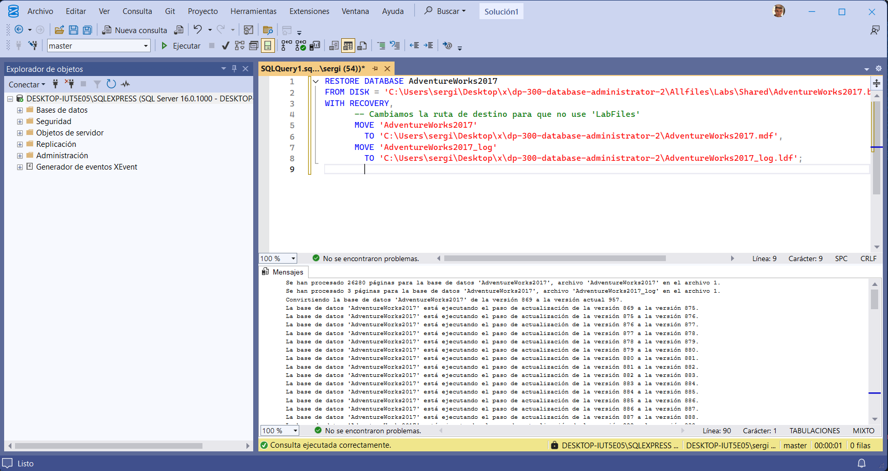
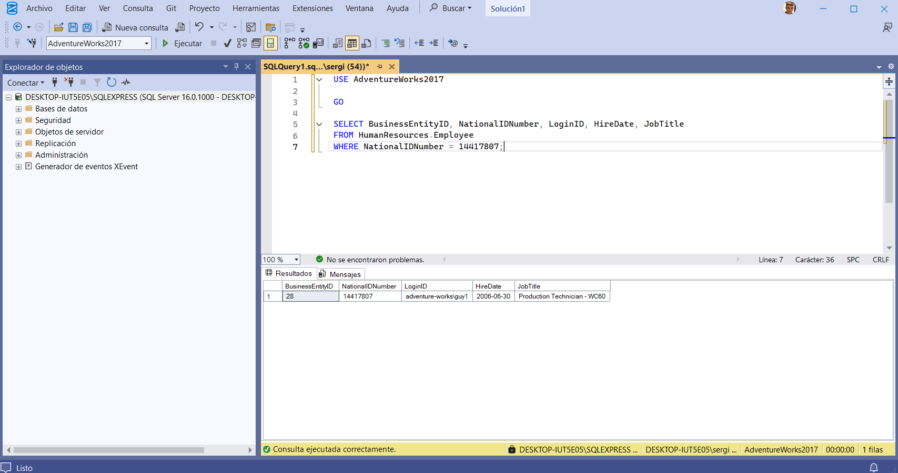
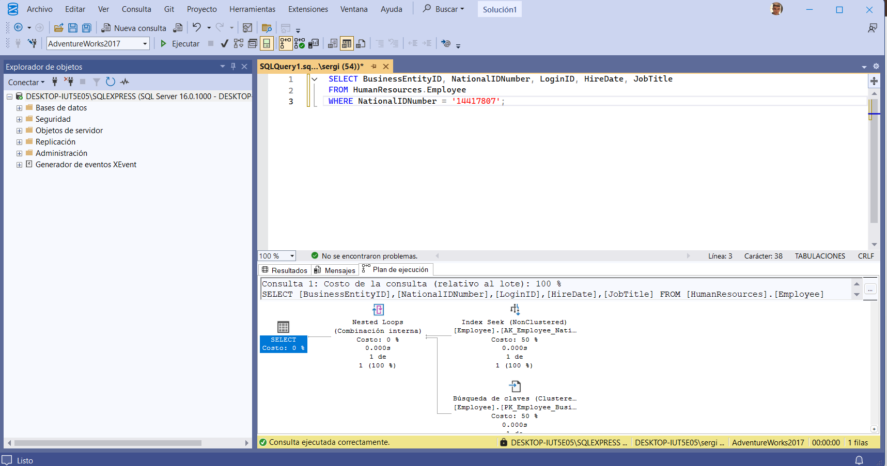
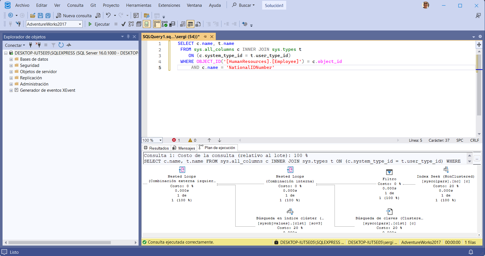

🛠️ LAB 12: Identificación de Problemas de Diseño de Bases de Datos
🎯 Objetivo
Evaluar el diseño de una base de datos para detectar y resolver problemas de rendimiento causados por conversiones implícitas, selección incorrecta de tipos de datos y diseño de índices. Se utilizará el Plan de Ejecución de SQL Server para diagnosticar ineficiencias.

💼 Rol
Administrador de Bases de Datos.

I. Configuración del Entorno y Base de Datos
1. Clonar el Repositorio Base (Si es necesario)
Se clona el repositorio de Microsoft Learning para obtener los archivos necesarios, incluyendo el .bak de la base de datos.

PowerShell

git clone https://github.com/MicrosoftLearning/dp-300-database-administrator.git
# Guardado en C:\LabFiles (o la ruta local)
2. Restaurar la Base de Datos AdventureWorks2017
Se restaura la base de datos AdventureWorks2017.bak en la instancia local de SQL Server usando SSMS.

SQL

RESTORE DATABASE AdventureWorks2017
FROM DISK = 'C:\LabFiles\dp-300-database-administrator\Allfiles\Labs\Shared\AdventureWorks2017.bak'
WITH RECOVERY,
      MOVE 'AdventureWorks2017' 
        TO 'C:\LabFiles\AdventureWorks2017.mdf',
      MOVE 'AdventureWorks2017_log'
        TO 'C:\LabFiles\AdventureWorks2017_log.ldf';
(Nota: Las rutas deben ajustarse a la ubicación real de los archivos).

📸 Captura 1: 

II. Diagnóstico del Problema (Conversión Implícita)
1. Ejecución de la Consulta Problemática
Se ejecuta una consulta para buscar un empleado por su NationalIDNumber. Se activa la opción Incluir plan de ejecución real (CTRL+M).

SQL

USE AdventureWorks2017
GO
    
SELECT BusinessEntityID, NationalIDNumber, LoginID, HireDate, JobTitle
FROM HumanResources.Employee
WHERE NationalIDNumber = 14417807;
2. Análisis del Plan de Ejecución
Al revisar el plan de ejecución, se observa una advertencia (triángulo amarillo) en el operador SELECT.

Causa: La columna NationalIDNumber está definida como NVARCHAR(15), pero en la consulta se le está pasando un valor numérico (INT).

Consecuencia: SQL Server debe realizar una conversión implícita de cada valor de la columna a número para poder compararlo, lo que impide el uso eficiente de los índices y aumenta el costo de CPU.

📸 Captura 2: 

III. Solución 1: Corrección del Código (Recomendada)
La forma más segura y rápida de resolver esto es modificar la consulta para que el tipo de dato del parámetro coincida con el de la columna.

1. Modificar la Consulta
Se añaden comillas simples al valor 14417807 para tratarlo como una cadena de texto (String), coincidiendo con el tipo NVARCHAR de la columna.

SQL

SELECT BusinessEntityID, NationalIDNumber, LoginID, HireDate, JobTitle
FROM HumanResources.Employee
WHERE NationalIDNumber = '14417807';
2. Verificación
Al ejecutar la consulta modificada, la advertencia de conversión implícita desaparece del plan de ejecución.

📸 Captura 3: 

IV. Solución 2: Corrección del Diseño (Cambio de Tipo de Dato)
Otra opción es cambiar la estructura de la tabla para que NationalIDNumber sea un INT, lo cual es más lógico para un número de identificación. Sin embargo, esto es más complejo debido a las dependencias (índices).

1. Intento Fallido (Dependencias)
Si se intenta cambiar la columna directamente:

SQL

ALTER TABLE [HumanResources].[Employee] ALTER COLUMN [NationalIDNumber] INT NOT NULL;
Se produce un error porque la columna está siendo usada por el índice AK_Employee_NationalIDNumber.

📸 Captura 4: 

2. Procedimiento Correcto (Drop & Recreate)
Para cambiar el tipo de dato, primero hay que eliminar el índice, cambiar la columna y luego volver a crear el índice.

SQL

USE AdventureWorks2017
GO
    
-- 1. Eliminar el índice dependiente
DROP INDEX [AK_Employee_NationalIDNumber] ON [HumanResources].[Employee]
GO

-- 2. Cambiar el tipo de dato de la columna a INT
ALTER TABLE [HumanResources].[Employee] ALTER COLUMN [NationalIDNumber] INT NOT NULL;
GO

-- 3. Recrear el índice
CREATE UNIQUE NONCLUSTERED INDEX [AK_Employee_NationalIDNumber] ON [HumanResources].[Employee]( [NationalIDNumber] ASC );
GO
3. Verificación del Cambio
Se verifica que la columna ahora es de tipo INT y que la consulta original (sin comillas) funciona sin advertencias.

SQL

-- Verificar tipo de dato
SELECT c.name, t.name
FROM sys.all_columns c INNER JOIN sys.types t
    ON (c.system_type_id = t.user_type_id)
WHERE OBJECT_ID('[HumanResources].[Employee]') = c.object_id
    AND c.name = 'NationalIDNumber'

📸 Captura 4: 

-- Probar consulta original (ahora optimizada por diseño)
SELECT BusinessEntityID, NationalIDNumber, LoginID, HireDate, JobTitle
FROM HumanResources.Employee
WHERE NationalIDNumber = 14417807;

📸 Captura 5: 

V. Conclusión
Se han demostrado dos formas de resolver problemas de rendimiento por tipos de datos:

Corrección de Código: Rápida y segura, alineando los parámetros de la consulta.

Corrección de Diseño: Más profunda, pero requiere tiempo de inactividad para reconstruir índices.

VI. Limpieza
Se elimina la base de datos AdventureWorks2017.
