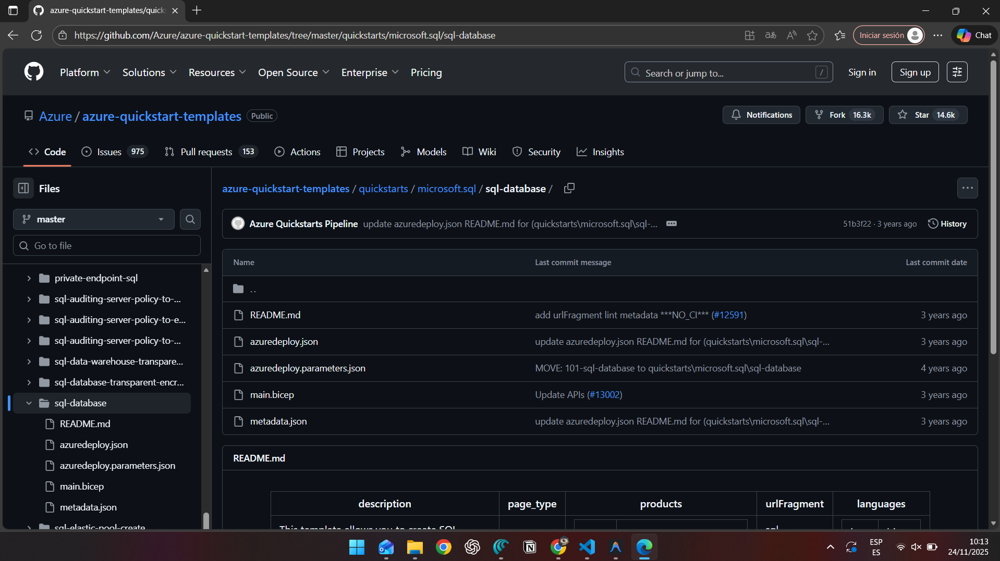
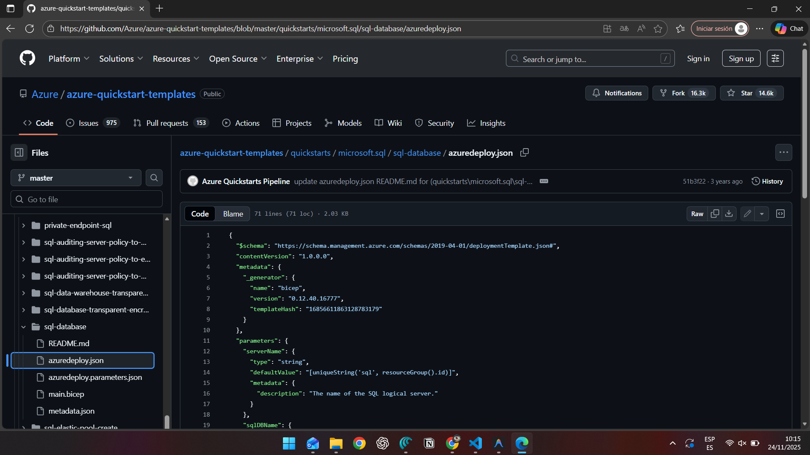
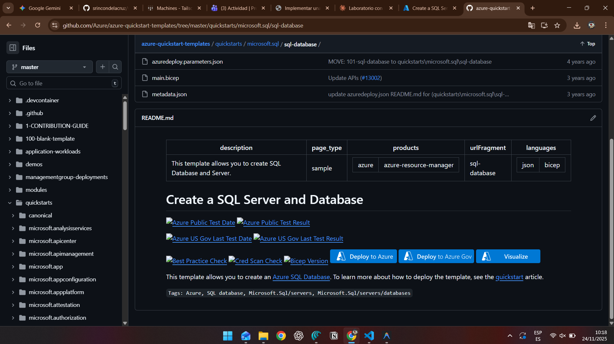
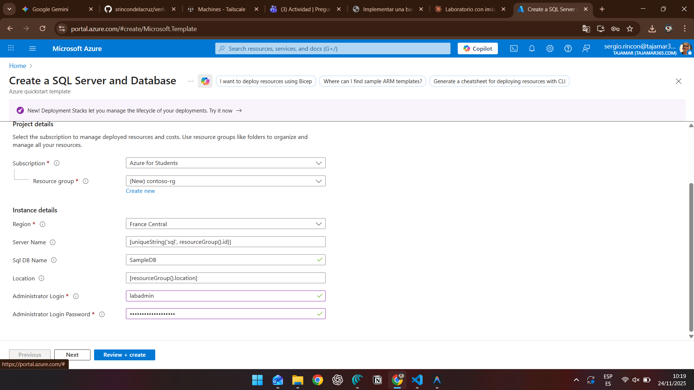
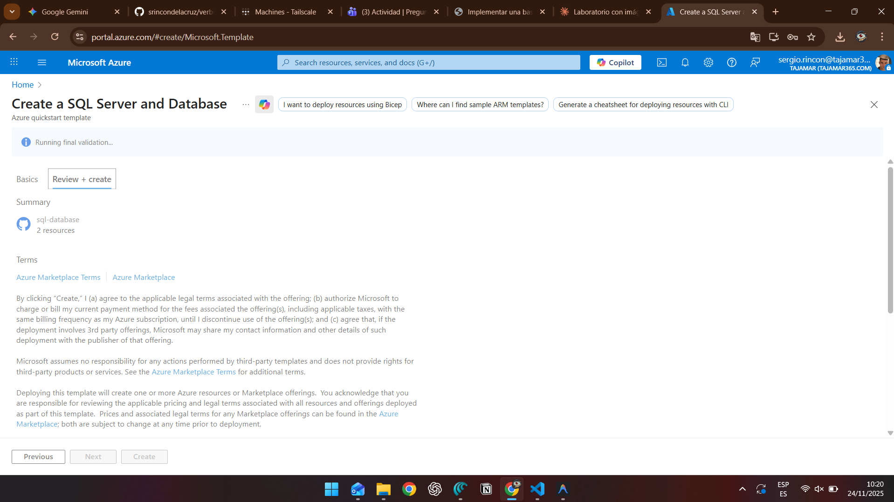
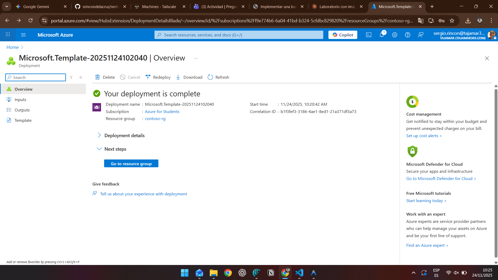
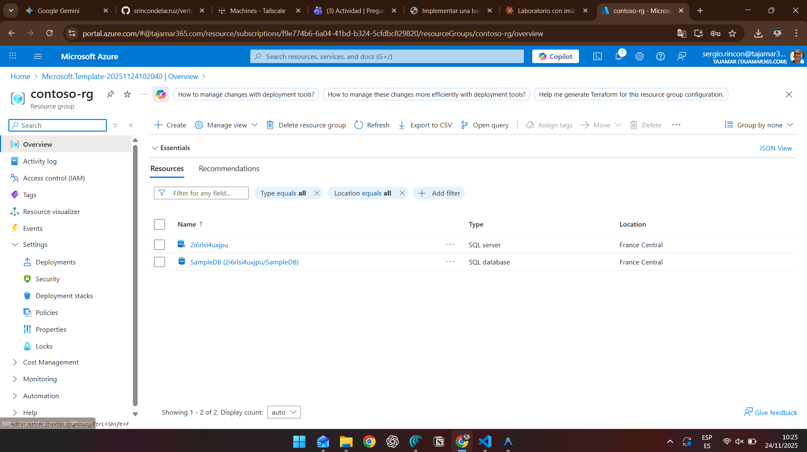
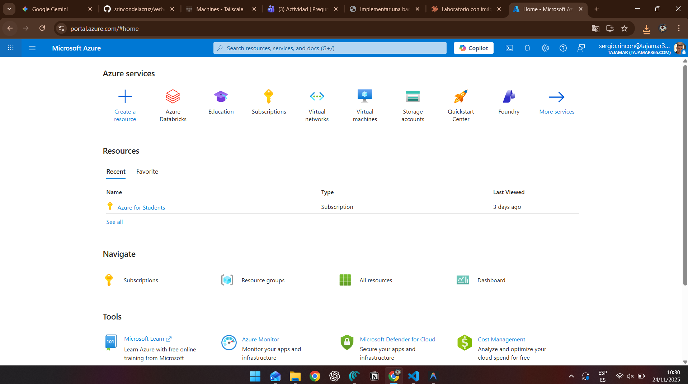

# Implementar una base de datos SQL de Azure desde una plantilla

**Tiempo estimado:** 15 minutos

## Descripción

Se le ha contratado como Ingeniero de Datos Sénior para automatizar las operaciones diarias de administración de bases de datos. Esta automatización garantiza que las bases de datos de AdventureWorks sigan funcionando al máximo rendimiento y proporciona métodos de alerta basados en ciertos criterios. AdventureWorks utiliza SQL Server tanto en infraestructura como servicio (IaaS) como en plataforma como servicio (PaaS).

---

## Paso 1: Explorar la plantilla de Azure Resource Manager

1. En Microsoft Edge, abra una nueva pestaña y navegue a la siguiente ruta en el repositorio de GitHub, que contiene una plantilla ARM para implementar un recurso de base de datos SQL:

```
https://github.com/Azure/azure-quickstart-templates/tree/master/quickstarts/microsoft.sql/sql-database
```



2. Haga clic con el botón derecho en **azuredeploy.json** y seleccione **Abrir enlace en una nueva pestaña** para ver la plantilla ARM. La plantilla debería verse similar a esto:

```json
{
  "$schema": "https://schema.management.azure.com/schemas/2019-04-01/deploymentTemplate.json#",
  "contentVersion": "1.0.0.0",
  "parameters": {
    "serverName": {
      "type": "string",
      "defaultValue": "[uniqueString('sql', resourceGroup().id)]",
      "metadata": {
        "description": "The name of the SQL logical server."
      }
    },
    "sqlDBName": {
      "type": "string",
      "defaultValue": "SampleDB",
      "metadata": {
        "description": "The name of the SQL Database."
      }
    },
    "location": {
      "type": "string",
      "defaultValue": "[resourceGroup().location]",
      "metadata": {
        "description": "Location for all resources."
      }
    },
    "administratorLogin": {
      "type": "string",
      "metadata": {
        "description": "The administrator username of the SQL logical server."
      }
    },
    "administratorLoginPassword": {
      "type": "securestring",
      "metadata": {
        "description": "The administrator password of the SQL logical server."
      }
    }
  },
  "variables": {},
  "resources": [
    {
      "type": "Microsoft.Sql/servers",
      "apiVersion": "2020-02-02-preview",
      "name": "[parameters('serverName')]",
      "location": "[parameters('location')]",
      "properties": {
        "administratorLogin": "[parameters('administratorLogin')]",
        "administratorLoginPassword": "[parameters('administratorLoginPassword')]"
      },
      "resources": [
        {
          "type": "databases",
          "apiVersion": "2020-08-01-preview",
          "name": "[parameters('sqlDBName')]",
          "location": "[parameters('location')]",
          "sku": {
            "name": "Standard",
            "tier": "Standard"
          },
          "dependsOn": [
            "[resourceId('Microsoft.Sql/servers', concat(parameters('serverName')))]"
          ]
        }
      ]
    }
  ]
}
```



3. Revise y observe las propiedades JSON de la plantilla.

---

## Paso 2: Implementar la plantilla en Azure

1. Cierre la pestaña **azuredeploy.json** y vuelva a la pestaña que contiene la carpeta **sql-database** de GitHub.

2. Desplácese hacia abajo y seleccione el botón **Implementar en Azure**.



3. Se abrirá la página de inicio rápido "**Crear una plantilla de SQL Server y una base de datos**" en Azure Portal. Complete los campos con la siguiente información:

   - **Grupo de recursos:** comenzando con `contoso-rg`
   - **Inicio de sesión de administrador de SQL:** `labadmin`
   - **Contraseña de inicio de sesión del administrador de SQL:** `<ingrese una contraseña segura>`



4. Seleccione **Revisar y crear** y, a continuación, seleccione **Crear**. La implementación tardará aproximadamente **5 minutos**.



---

## Paso 3: Verificar la implementación

1. Una vez finalizada la implementación, seleccione **Ir al grupo de recursos**.



2. Accederá a su grupo de recursos de Azure, que contiene un recurso de SQL Server con un nombre aleatorio creado por la implementación.



---

## Limpieza de recursos

Si no utiliza Azure SQL Server para ningún otro propósito, puede limpiar los recursos que creó en este laboratorio.

### Opción 1: Eliminar el grupo de recursos completo

Si creó un nuevo grupo de recursos para este laboratorio, puede eliminar el grupo de recursos para quitar todos los recursos creados.

1. En el portal de Azure, seleccione **Grupos de recursos** en el panel de navegación izquierdo.

2. Acceda al grupo de recursos que creó para este laboratorio.



3. Seleccione **Eliminar grupo de recursos** en el menú superior.

4. En el cuadro de diálogo **Eliminar grupo de recursos**, escriba el nombre del grupo de recursos para confirmar y seleccione **Eliminar**.


5. Espere a que se elimine el grupo de recursos y cierre el portal de Azure.

### Opción 2: Eliminar únicamente los recursos del laboratorio

Si no creó un nuevo grupo de recursos para este laboratorio y desea dejar el grupo de recursos y sus recursos anteriores intactos, aún puede eliminar los recursos creados en este laboratorio.

1. En el portal de Azure, acceda al grupo de recursos.

2. Seleccione todos los recursos que tengan como prefijo el nombre de SQL Server que especificó previamente en el laboratorio.


3. Seleccione **Eliminar** en el menú superior.

4. En el cuadro de diálogo **Eliminar recursos**, escriba `eliminar` y seleccione **Eliminar**.


5. Confirme la eliminación y espere a que se eliminen los recursos. Cierre el portal de Azure.

---

## Conclusión

¡Has completado este laboratorio exitosamente! 🎉

Acabas de ver cómo, con un solo clic en un vínculo de plantilla de Azure Resource Manager, puedes crear fácilmente un servidor y una base de datos de Azure SQL.

### Lo que aprendiste:

- Explorar plantillas ARM en GitHub
- Analizar la estructura JSON de una plantilla ARM
- Implementar recursos de Azure usando plantillas
- Gestionar y eliminar recursos en Azure Portal

---

## Recursos adicionales

- [Documentación de Azure SQL Database](https://docs.microsoft.com/azure/azure-sql/)
- [Plantillas de inicio rápido de Azure](https://github.com/Azure/azure-quickstart-templates)
- [Documentación de Azure Resource Manager](https://docs.microsoft.com/azure/azure-resource-manager/)