# Crear una Alerta de Estado de CPU para SQL Server en Azure

⏱️ **Tiempo estimado:** 20 minutos

## Objetivo

Automatizar la monitorización de bases de datos AdventureWorks mediante alertas basadas en el uso de CPU.

---

## Prerrequisitos

- Cuenta de Azure activa
- Visual Studio Code instalado
- Git instalado

---

## Parte 1: Configuración del Entorno

### 1.1 Clonar el Repositorio

Si los archivos no están en `C:\LabFiles`:

1. Abre Visual Studio Code
2. Presiona `Ctrl+Shift+P` y escribe `Git: Clone`
3. Pega la URL del repositorio:
   ```
   https://github.com/MicrosoftLearning/dp-300-database-administrator.git
   ```
4. Guarda en `C:\LabFiles`

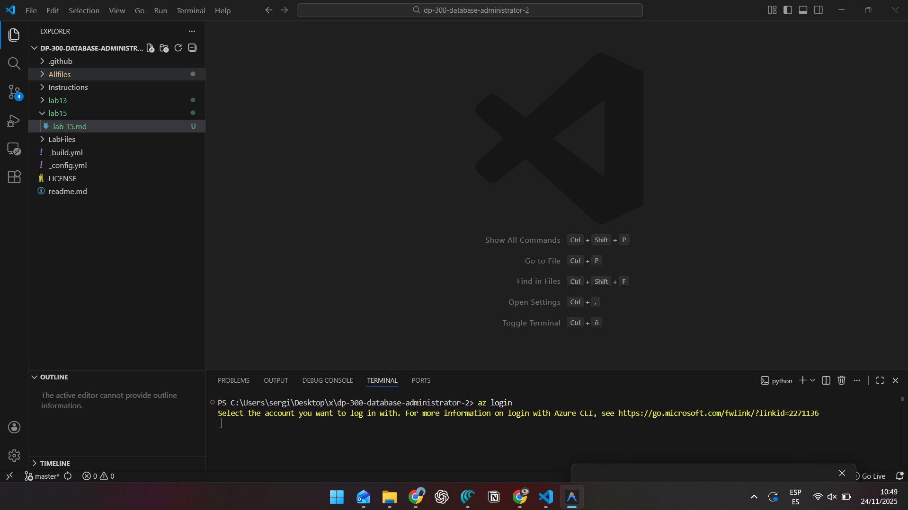

---

## Parte 2: Crear SQL Server en Azure

### 2.1 Desplegar Recursos con CLI

1. En VS Code, clic derecho en `/Allfiles/Labs` → **Abrir en terminal integrada**
2. Ejecuta los siguientes comandos:
   ```bash
   az login
   ```

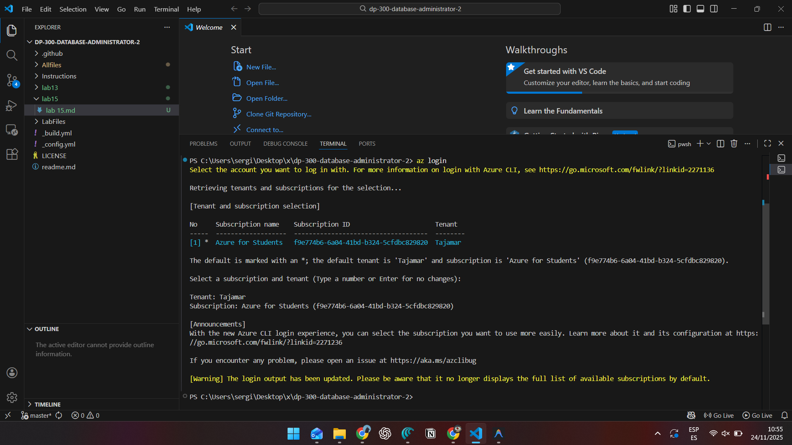

3. Inicia sesión en el navegador con tus credenciales de Azure
4. Ejecuta el script de despliegue:
   ```bash
   cd ./Setup
   ./deploy-sql-database.ps1
   ```

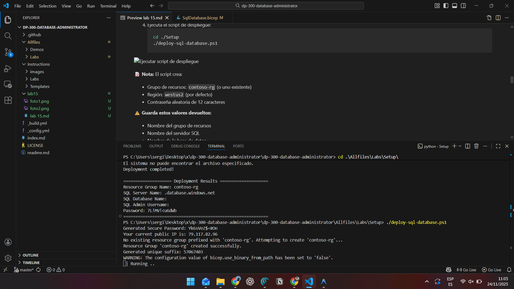

**📝 Nota:** El script crea:
- Grupo de recursos: `contoso-rg` (o uno existente)
- Región: `westus2` (por defecto)
- Contraseña aleatoria de 12 caracteres

**⚠️ Guarda estos valores devueltos:**
- Nombre del grupo de recursos
- Nombre del servidor SQL
- Nombre de la base de datos
- Usuario y contraseña del administrador

---

## Parte 3: Crear la Alerta de CPU

### 3.1 Acceder a la Base de Datos

1. Navega a https://portal.azure.com
2. En la barra de búsqueda, escribe `bases de datos SQL` y selecciona **Bases de datos SQL**
3. Selecciona la base de datos **AdventureWorksLT**


### 3.2 Configurar la Alerta

1. En el menú lateral, ve a la sección **Monitoreo** → **Alertas**
2. Haz clic en **Crear regla de alerta**

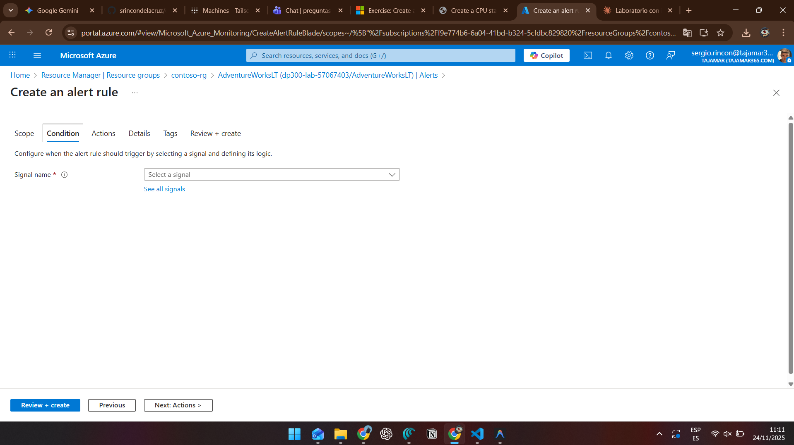

3. Selecciona la señal **Porcentaje de CPU**

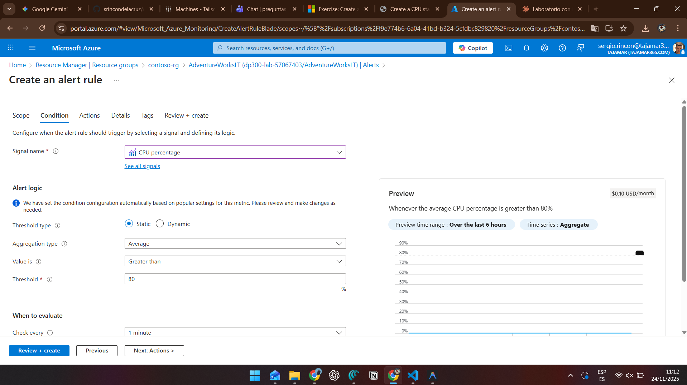

4. Configura la lógica de alerta:
   - **Tipo de umbral:** Estático
   - **Tipo de agregación:** Promedio
   - **Operador:** Mayor que
   - **Valor de umbral:** `80`
   - Revisa los valores de **Comprobar cada** y **Periodo retrospectivo**

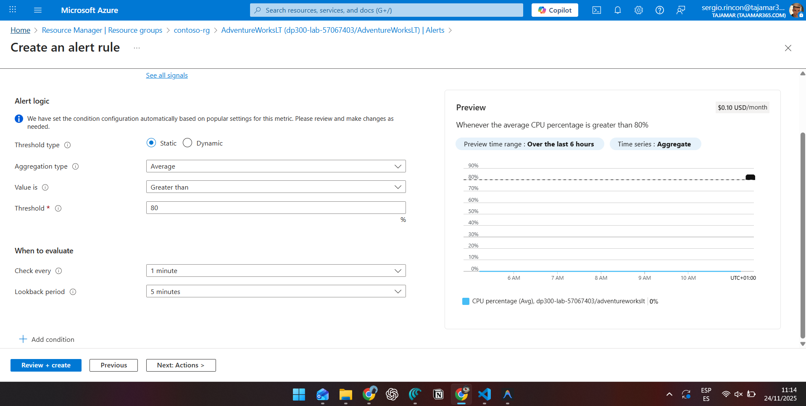

5. Haz clic en **Siguiente: Acciones >**

### 3.3 Crear Grupo de Acciones

1. Haz clic en **Crear grupo de acciones**
2. En la pestaña **Básico**:
   - **Nombre del grupo de acciones:** `emailgroup`
   - **Nombre para mostrar:** `emailgroup`

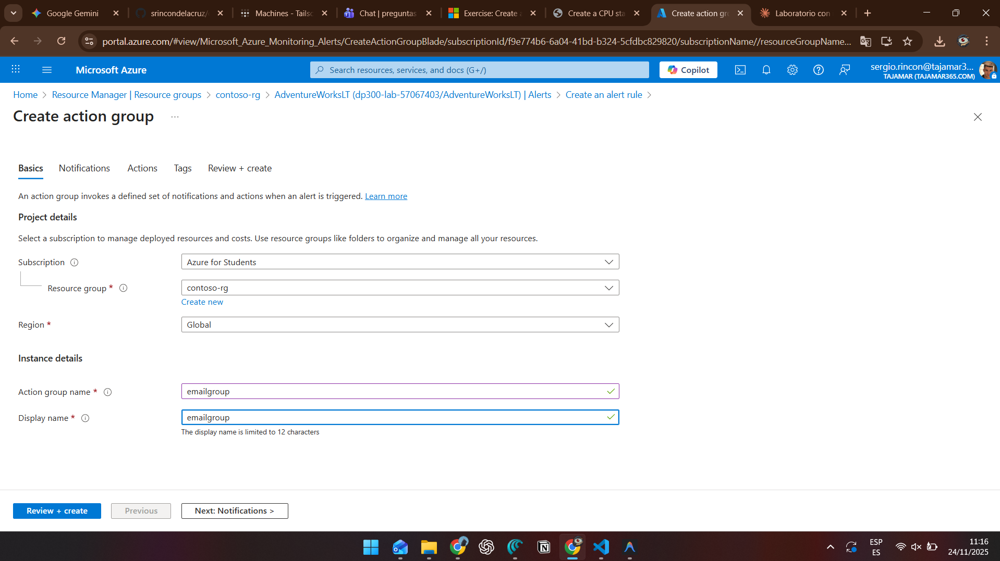

3. Haz clic en **Siguiente: Notificaciones >**
4. Configura la notificación:
   - **Tipo de notificación:** Email/SMS/Push/Voz
   - Marca la casilla **Correo electrónico**
   - Introduce tu dirección de correo de Azure
   - Haz clic en **Aceptar**
   - **Nombre:** `DemoLab`

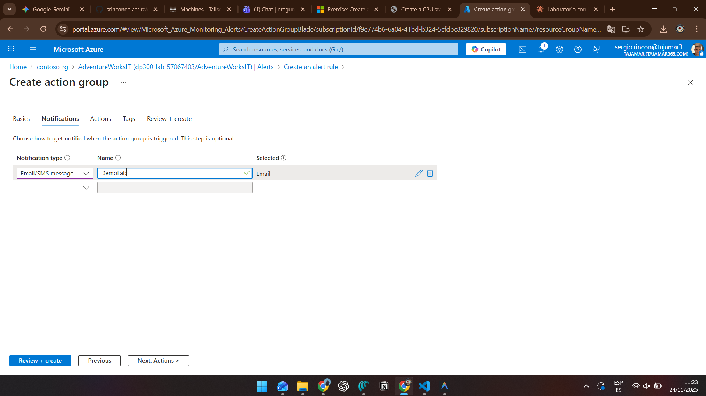

5. Haz clic en **Revisar + crear** → **Crear**

### 3.4 Finalizar la Regla de Alerta

1. De vuelta en **Crear una regla de alerta**, haz clic en **Siguiente: Detalles >**
2. Asigna un **nombre único** a la regla de alerta

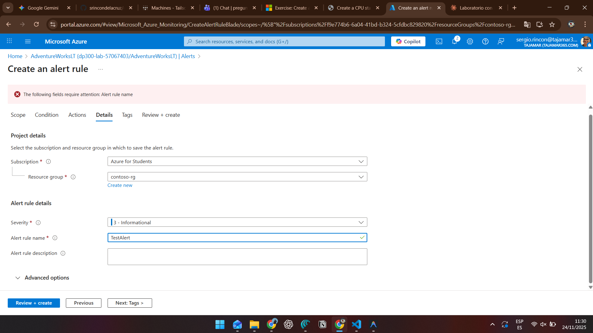

3. Haz clic en **Revisar + crear** → **Crear**

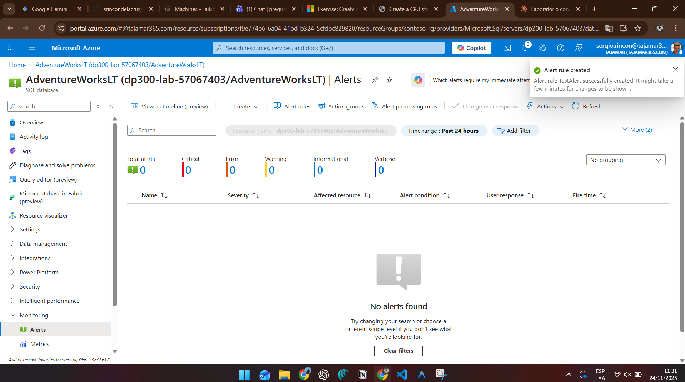

---

## Parte 4: Limpieza de Recursos

### Opción A: Eliminar el Grupo de Recursos Completo

1. En el Portal de Azure, busca **Grupos de recursos**
2. Selecciona el grupo de recursos creado (`contoso-rg`)
3. Haz clic en **Eliminar grupo de recursos**
4. Escribe el nombre del grupo para confirmar
5. Haz clic en **Eliminar**

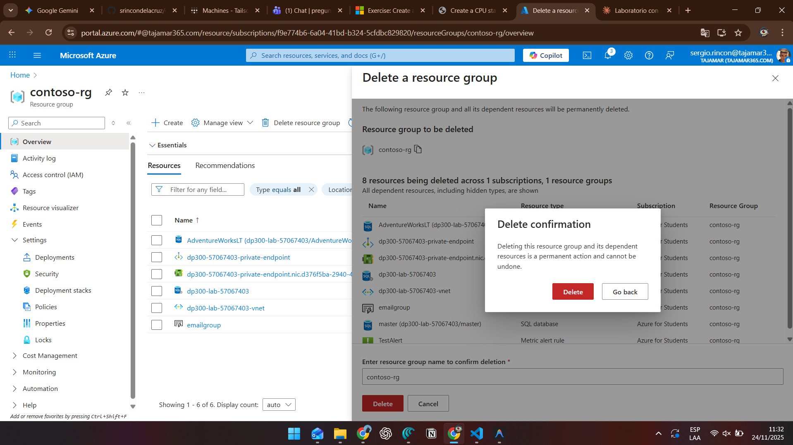

### Opción B: Eliminar Solo los Recursos del Laboratorio

1. Accede al grupo de recursos
2. Selecciona todos los recursos con el prefijo del SQL Server
3. Haz clic en **Eliminar** en el menú superior
4. Escribe `eliminar` para confirmar
5. Confirma nuevamente la eliminación

---

## Resultado

✅ Has configurado exitosamente una alerta que enviará un correo electrónico cuando el uso promedio de CPU del servidor SQL supere el 80%.

---

## Notas Adicionales

- La contraseña debe cumplir con los requisitos de Azure SQL (mínimo 12 caracteres, mayúsculas, minúsculas, números y caracteres especiales)
- El script agrega automáticamente tu IP pública a las reglas de firewall
- Puedes personalizar el script con los parámetros: `-rgName`, `-location`, `-sqlAdminPw`
