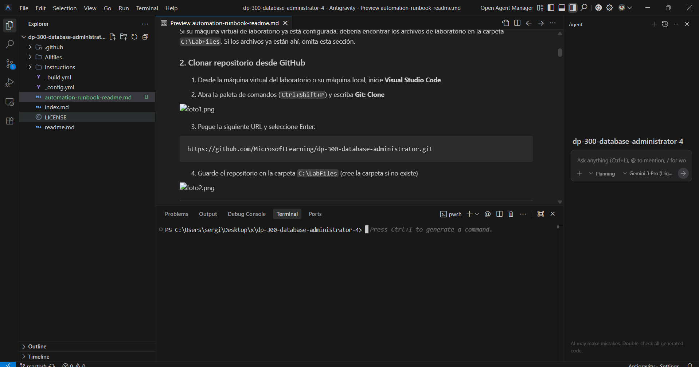
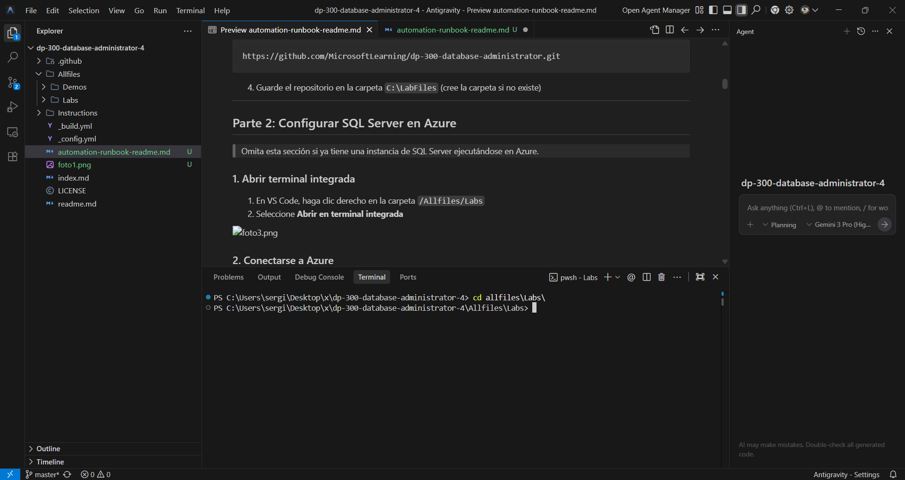

# Implementar un Runbook de Automatización para Reconstruir Índices Automáticamente

**Tiempo estimado:** 30 minutos

## Descripción

Se le ha contratado como Administrador Sénior de Bases de Datos para automatizar las operaciones diarias de administración de bases de datos. Esta automatización garantiza que las bases de datos de AdventureWorks sigan funcionando al máximo rendimiento y proporciona métodos de alerta basados en ciertos criterios. AdventureWorks utiliza SQL Server tanto en infraestructura como servicio (IaaS) como en plataforma como servicio (PaaS).

> 📝 Estos ejercicios pueden requerir copiar y pegar código T-SQL y utilizan recursos SQL existentes. Verifique que el código se haya copiado correctamente antes de ejecutarlo.

---

## Parte 1: Entorno de Configuración

### 1. Verificar archivos de laboratorio

Si su máquina virtual de laboratorio ya está configurada, debería encontrar los archivos de laboratorio en la carpeta `C:\LabFiles`. Si los archivos ya están ahí, omita esta sección.

### 2. Clonar repositorio desde GitHub

1. Desde la máquina virtual del laboratorio o su máquina local, inicie **Visual Studio Code**

2. Abra la paleta de comandos (`Ctrl+Shift+P`) y escriba **Git: Clone**



3. Pegue la siguiente URL y seleccione Enter:

```
https://github.com/MicrosoftLearning/dp-300-database-administrator.git
```

4. Guarde el repositorio en la carpeta `C:\LabFiles` (cree la carpeta si no existe)


---

## Parte 2: Configurar SQL Server en Azure

> Omita esta sección si ya tiene una instancia de SQL Server ejecutándose en Azure.

### 1. Abrir terminal integrada

1. En VS Code, haga clic derecho en la carpeta `/Allfiles/Labs`
2. Seleccione **Abrir en terminal integrada**
3. 


**Lo que debería verse:** Terminal integrada de VS Code abierta en la parte inferior de la ventana, mostrando el prompt con la ruta del directorio `/Allfiles/Labs`.

### 2. Conectarse a Azure

Ejecute el siguiente comando:

```bash
az login
```


Se abrirá una ventana del navegador. Use sus credenciales de Azure para iniciar sesión.

**Lo que debería verse:** Ventana del navegador mostrando la página de login de Microsoft Azure con el formulario de autenticación (email y contraseña). Tras iniciar sesión correctamente, aparecerá un mensaje de confirmación.

### 3. Ejecutar script de despliegue

Ejecute el siguiente comando:

```bash
cd ./Setup
./deploy-sql-database.ps1
```

**Lo que debería verse:** Terminal ejecutando el script PowerShell con mensajes de progreso mostrando la creación del grupo de recursos, servidor SQL y base de datos. Al final debería mostrar los valores de salida: nombre del servidor, base de datos, usuario administrador y contraseña generada.

> 📝 **Notas importantes:**
> - El script creará un grupo de recursos llamado `contoso-rg` (o usará uno existente con ese prefijo)
> - Creará todos los recursos en la región **West US 2** (westus2) por defecto
> - Generará una contraseña aleatoria de 12 caracteres para el administrador SQL
> - Puede personalizar estos valores usando los parámetros: `-rgName`, `-location` y `-sqlAdminPw`
> - El script agregará su dirección IP pública actual a las reglas de firewall del servidor SQL

> ⚠️ **IMPORTANTE:** Si el script falla (es normal según el profesor), deberás crear los recursos manualmente desde Azure Portal:
> 1. Crea un grupo de recursos llamado `contoso-rg`
> 2. Crea un Azure SQL Server en ese grupo
> 3. Crea una base de datos llamada `AdventureWorksLT` en ese servidor
> 4. Anota el nombre del servidor, usuario admin (ej: `sqladmin`) y la contraseña que establezcas

4. Una vez completado el script (o creados manualmente), **anote los siguientes valores** (los necesitará más adelante):
   - Nombre del grupo de recursos
   - Nombre del servidor SQL
   - Nombre de la base de datos
   - Nombre de usuario del administrador
   - Contraseña del administrador

---

## Parte 3: Crear una Cuenta de Automatización

1. Inicie sesión en [Azure Portal](https://portal.azure.com)

2. En la barra de búsqueda, escriba **automatización** y seleccione **Cuentas de automatización**

**Lo que debería verse:** Portal de Azure mostrando los resultados de búsqueda con "Cuentas de automatización" resaltado y el botón "+ Crear" visible en la barra superior.

3. Seleccione **+ Crear**

4. Ingrese la siguiente información:
   - **Grupo de recursos:** Su grupo de recursos
   - **Nombre de la cuenta de automatización:** `autoAccount`
   - **Región:** Use el valor predeterminado

**Lo que debería verse:** Formulario "Crear una cuenta de automatización" con los campos completados: suscripción seleccionada, grupo de recursos "contoso-rg", nombre "autoAccount" y región seleccionada (probablemente West US 2).

5. Seleccione **Revisar + Crear** y luego **Crear**

> 📝 Tu cuenta de automatización podría tardar unos minutos en crearse.

---

## Parte 4: Conectarse a la Base de Datos SQL

### 1. Acceder a la base de datos

1. En el portal de Azure, busque **bases de datos SQL**
2. Seleccione la base de datos SQL **AdventureWorksLT**

**Lo que debería verse:** Lista de bases de datos SQL en Azure Portal mostrando la base de datos "AdventureWorksLT" con su estado "En línea", el servidor asociado y la ubicación.

### 2. Abrir el Editor de Consultas

1. En la página de la base de datos, seleccione **Editor de consultas (vista previa)**
2. Ingrese las credenciales de administrador de la base de datos y seleccione **Aceptar**

**Lo que debería verse:** Ventana de login del Editor de consultas mostrando campos para Tipo de autenticación (SQL Server Authentication), Inicio de sesión (sqladmin) y Contraseña.

### 3. Configurar reglas de firewall (si es necesario)

Si recibe un error de acceso denegado:

1. Seleccione **Añadir IP de cliente** y luego **Guardar**
2. Regrese a la pestaña anterior y seleccione **Aceptar**

**Lo que debería verse:** Banner de error en el Editor de consultas con el mensaje de acceso denegado y botón "Añadir IP de cliente" visible, o alternativamente la página de configuración de firewall mostrando las reglas con la opción de agregar la IP actual.

**Alternativa:** Si el método anterior no funciona:

1. Seleccione **Establecer firewall del servidor** en la barra de menú superior
2. Seleccione **Agregar su dirección IPv4 actual** y luego **Guardar**
3. Regrese a la página de la base de datos y seleccione **Editor de consultas (vista previa)** nuevamente

### 4. Cargar y ejecutar el procedimiento almacenado

1. En el editor de consultas, seleccione **Abrir consulta**

**Lo que debería verse:** Editor de consultas de Azure SQL Database con el panel de consultas vacío y el botón "Abrir consulta" visible en la barra de herramientas superior.

2. Navegue a `C:\LabFiles\dp-300-database-administrator\Allfiles\Labs\Module13`
3. Seleccione el archivo **usp_AdaptiveIndexDefrag.sql** y haga clic en **Abrir**

4. **Elimine** las líneas 5 y 6 (`USE msdb` y `GO`)

5. Seleccione **Ejecutar**

**Lo que debería verse:** Editor de consultas mostrando el código T-SQL del procedimiento almacenado usp_AdaptiveIndexDefrag con las líneas USE msdb y GO eliminadas, y el botón "Ejecutar" resaltado. Debajo debería aparecer el mensaje "Comandos completados correctamente".

6. Expanda la carpeta **Procedimientos almacenados** para verificar que se creó correctamente

---

## Parte 5: Configurar los Activos de la Cuenta de Automatización

### 1. Importar el módulo SqlServer

1. En el portal de Azure, busque y seleccione **Cuentas de automatización**
2. Seleccione la cuenta **autoAccount**
3. En la sección **Recursos compartidos**, seleccione **Módulos**
4. Seleccione **Explorar galería**

**Lo que debería verse:** Página de la cuenta de automatización "autoAccount" mostrando el menú lateral izquierdo con "Módulos" resaltado bajo "Recursos compartidos", y el botón "Explorar galería" visible en la parte superior.

5. Busque **SqlServer**
6. Seleccione **SqlServer** y luego **Seleccionar**

**Lo que debería verse:** Galería de módulos de PowerShell mostrando el módulo "SqlServer" en los resultados de búsqueda con su descripción, autor (Microsoft) y el botón "Seleccionar".

7. En la página **Agregar un módulo**, seleccione la última versión del entorno de ejecución disponible
8. Seleccione **Importar**

### 2. Crear credenciales

1. Desde la cuenta de automatización, navegue a **Recursos compartidos** > **Credenciales**
2. Seleccione **+ Agregar una credencial**

**Lo que debería verse:** Página de "Credenciales" dentro de la cuenta de automatización mostrando la lista de credenciales (probablemente vacía) y el botón "+ Agregar una credencial" en la parte superior.

3. Ingrese la siguiente información:
   - **Nombre:** `SQLUser`
   - **Nombre de usuario:** `sqladmin`
   - **Contraseña:** (Una contraseña segura de 12+ caracteres con mayúsculas, minúsculas, números y caracteres especiales)
   - **Confirmar contraseña:** (Repita la contraseña)

4. Seleccione **Crear**

---

## Parte 6: Crear un Runbook de PowerShell

### 1. Obtener el nombre del servidor

1. En el portal de Azure, busque **bases de datos SQL**
2. Seleccione la base de datos **AdventureWorksLT**
3. En la página **Descripción general**, copie el **nombre del servidor** (debe empezar por `dp300-lab`)

**Lo que debería verse:** Página de "Descripción general" de la base de datos AdventureWorksLT mostrando las propiedades esenciales. El campo "Nombre del servidor" debería estar visible con un valor como "dp300-lab-xxxxx.database.windows.net" y un icono de copiar al lado.

### 2. Crear el runbook

1. En el portal de Azure, busque **Cuentas de automatización**
2. Seleccione **autoAccount**
3. En **Automatización de procesos**, seleccione **Runbooks**

**Lo que debería verse:** Página de la cuenta de automatización "autoAccount" con el menú lateral mostrando "Runbooks" seleccionado bajo "Automatización de procesos". La lista de runbooks debería mostrar dos runbooks creados automáticamente durante el despliegue (AzureAutomationTutorial y AzureAutomationTutorialScript).

4. Seleccione **+ Crear un runbook**

5. Ingrese la siguiente información:
   - **Nombre del runbook:** `IndexMaintenance`
   - **Tipo de runbook:** PowerShell
   - **Versión del entorno de ejecución:** Seleccione la última disponible

6. Seleccione **Revisar + Crear** y luego **Crear**

**Lo que debería verse:** Formulario "Crear un runbook" mostrando los campos completados: nombre "IndexMaintenance", tipo "PowerShell" seleccionado en el dropdown, y versión de runtime seleccionada (por ejemplo, 7.2 o superior).

### 3. Añadir el código PowerShell

Copie y pegue el siguiente código en el editor del runbook:

```powershell
$AzureSQLServerName = ''
$DatabaseName = 'AdventureWorksLT'
    
$Cred = Get-AutomationPSCredential -Name "SQLUser"
$SQLOutput = $(Invoke-Sqlcmd -ServerInstance $AzureSQLServerName -UserName $Cred.UserName -Password $Cred.GetNetworkCredential().Password -Database $DatabaseName -Query "EXEC dbo.usp_AdaptiveIndexDefrag" -Verbose) 4>&1

Write-Output $SQLOutput
```

**Lo que debería verse:** Editor de runbook de PowerShell mostrando el código pegado. La interfaz debería tener un área de texto grande con el código PowerShell visible y botones en la parte superior como "Guardar", "Publicar", "Iniciar" y "Probar". El fondo del editor suele ser oscuro con sintaxis resaltada en diferentes colores.

> 📝 **Importante:** En la primera línea del script, pegue el nombre del servidor que copió anteriormente entre las comillas.

4. Seleccione **Guardar** y luego **Publicar**

5. Seleccione **Sí** para confirmar la acción de publicación

**Lo que debería verse:** Cuadro de diálogo de confirmación preguntando "¿Está seguro de que desea publicar este runbook?" con botones "Sí" y "No". Después de confirmar, el runbook mostrará el estado cambiado a "Publicado" en la parte superior de la página.

---

## Parte 7: Crear un Cronograma para el Runbook

### 1. Acceder a las programaciones

1. En el runbook **IndexMaintenance**, en **Recursos**, seleccione **Programaciones**
2. Seleccione **+ Agregar un horario**

**Lo que debería verse:** Página del runbook "IndexMaintenance" mostrando la sección "Programaciones" en el menú lateral bajo "Recursos". La página principal debería mostrar un área vacía con el mensaje "No hay programaciones vinculadas a este runbook" y el botón "+ Agregar un horario" visible en la parte superior.

3. Seleccione **Vincular una programación a su runbook**
4. Seleccione **+ Agregar un horario**

### 2. Configurar la programación

Ingrese la siguiente información:

- **Nombre:** `DailyIndexDefrag`
- **Descripción:** Desfragmentación del índice diario para la base de datos AdventureWorksLT
- **Comienza:** 4:00 AM (día siguiente)
- **Zona horaria:** Seleccione su zona horaria local
- **Recurrencia:** Recurrente
- **Repetir cada:** 1 día
- **Establecer vencimiento:** No

**Lo que debería verse:** Formulario "Crear una programación" mostrando todos los campos completados: nombre "DailyIndexDefrag", descripción, fecha y hora de inicio con selector de calendario y reloj, zona horaria en dropdown (por ejemplo "UTC+01:00 Madrid"), recurrencia configurada como "Recurrente", intervalo "1 Día(s)", y casilla de vencimiento desmarcada.

3. Seleccione **Crear** y luego **Aceptar**

4. El programa ya está creado y vinculado. Seleccione **Aceptar**

**Lo que debería verse:** Página de "Programaciones" del runbook mostrando ahora la programación "DailyIndexDefrag" en la lista con columnas que incluyen: nombre, descripción, próxima ejecución (fecha y hora), frecuencia ("Diaria"), y estado "Habilitado".

---

## ✅ Verificación

El runbook está configurado y programado para ejecutarse diariamente a las 4:00 AM. Azure Automation ejecutará el procedimiento almacenado que desfragmenta los índices de la base de datos AdventureWorksLT automáticamente.

---

## Limpieza de Recursos

### Opción 1: Eliminar el grupo de recursos completo

1. En el portal de Azure, seleccione **Grupos de recursos**
2. Acceda al grupo de recursos que creó para este laboratorio
3. Seleccione **Eliminar grupo de recursos**
4. Escriba el nombre del grupo de recursos para confirmar
5. Seleccione **Eliminar**

### Opción 2: Eliminar únicamente los recursos del laboratorio

1. En el portal de Azure, seleccione **Grupos de recursos**
2. Acceda al grupo de recursos del laboratorio
3. Seleccione todos los recursos con prefijo del nombre de SQL Server
4. Seleccione **Eliminar** en el menú superior
5. Escriba `eliminar` y confirme

### Opción 3: Eliminar la carpeta LabFiles

1. Abra el explorador de archivos
2. Navegue hasta la unidad `C:\`
3. Haga clic derecho en la carpeta **LabFiles**
4. Seleccione **Eliminar**
5. Confirme la eliminación

---

## Conclusión

¡Has completado este laboratorio exitosamente! 🎉

Has aprendido a:

- Configurar una cuenta de Azure Automation
- Crear credenciales seguras para conexiones SQL
- Desarrollar runbooks de PowerShell para tareas de mantenimiento
- Programar ejecuciones automáticas de runbooks
- Implementar mantenimiento automático de índices en bases de datos SQL

Azure Automation ofrece un servicio de configuración y automatización basado en la nube que admite una administración consistente en todos sus entornos de Azure y otros entornos.

---

## Recursos Adicionales

- [Documentación de Azure Automation](https://docs.microsoft.com/azure/automation/)
- [Runbooks en Azure Automation](https://docs.microsoft.com/azure/automation/automation-runbook-types)
- [Mantenimiento de índices en SQL Server](https://docs.microsoft.com/sql/relational-databases/indexes/reorganize-and-rebuild-indexes)