# Configurar la Replicación Geográfica para Azure SQL Database

**Tiempo estimado:** 30 minutos

## Descripción

Como administrador de bases de datos (DBA) en AdventureWorks, debe habilitar la replicación geográfica para Azure SQL Database y asegurarse de que funcione correctamente. Además, deberá conmutar manualmente a otra región mediante el portal.

> 📝 Estos ejercicios pueden requerir copiar y pegar código T-SQL y utilizan recursos SQL existentes. Verifique que el código se haya copiado correctamente antes de ejecutarlo.

---

## Parte 1: Entorno de Configuración

### 1. Verificar archivos de laboratorio

Si su máquina virtual de laboratorio ya está configurada, debería encontrar los archivos de laboratorio en la carpeta `C:\LabFiles`. Si los archivos ya están ahí, omita esta sección.

### 2. Clonar repositorio desde GitHub

1. Desde la máquina virtual del laboratorio o su máquina local, inicie **Visual Studio Code**

2. Abra la paleta de comandos (`Ctrl+Shift+P`) y escriba **Git: Clone**

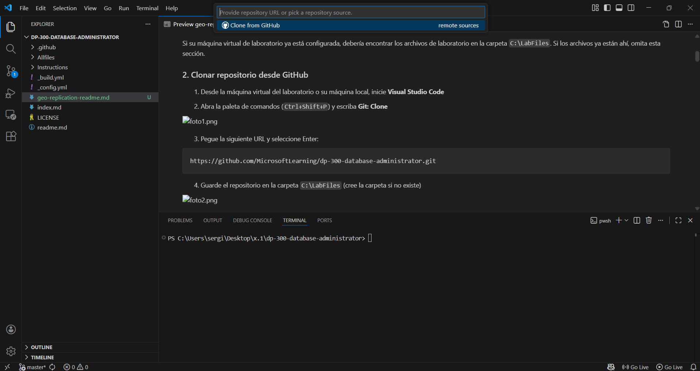

3. Pegue la siguiente URL y seleccione Enter:

```
https://github.com/MicrosoftLearning/dp-300-database-administrator.git
```

4. Guarde el repositorio en la carpeta `C:\LabFiles` (cree la carpeta si no existe)


---

## Parte 2: Configurar SQL Server en Azure

> Omita esta sección si ya tiene una instancia de SQL Server ejecutándose en Azure.

### 1. Abrir terminal integrada

1. En VS Code, haga clic derecho en la carpeta `/Allfiles/Labs`
2. Seleccione **Abrir en terminal integrada**

**Lo que debería verse:** Terminal integrada de VS Code abierta en la parte inferior mostrando el prompt en la ruta de la carpeta Labs.

### 2. Conectarse a Azure

Ejecute el siguiente comando:

```bash
az login
```

Se abrirá una ventana del navegador. Use sus credenciales de Azure para iniciar sesión.

**Lo que debería verse:** Ventana del navegador con la página de login de Azure mostrando confirmación de inicio de sesión exitoso.

### 3. Ejecutar script de despliegue

Ejecute los siguientes comandos:

```bash
cd ./Setup
./deploy-sql-database.ps1
```

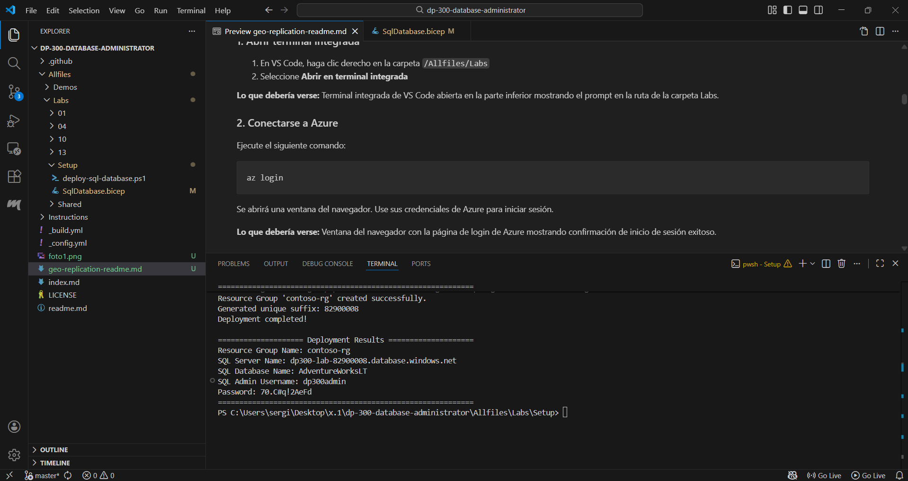

> 📝 **Notas importantes:**
> - Script crea grupo de recursos `contoso-rg` por defecto
> - Región por defecto: **West US 2** (westus2)
> - Genera contraseña aleatoria de 12 caracteres
> - Parámetros personalizables: `-rgName`, `-location`, `-sqlAdminPw`
> - Agrega tu IP pública a las reglas de firewall

> ⚠️ **IMPORTANTE:** Si el script falla, crea los recursos manualmente desde Azure Portal.

**Anote estos valores** (los necesitará más adelante):
- Nombre del grupo de recursos
- Nombre del servidor SQL
- Nombre de la base de datos
- Usuario administrador
- Contraseña administrador

---

## Parte 3: Habilitar la Replicación Geográfica

### 1. Acceder a la base de datos

1. Inicie sesión en [Azure Portal](https://portal.azure.com)
2. Busque **bases de datos SQL**
3. Seleccione la base de datos **AdventureWorksLT**

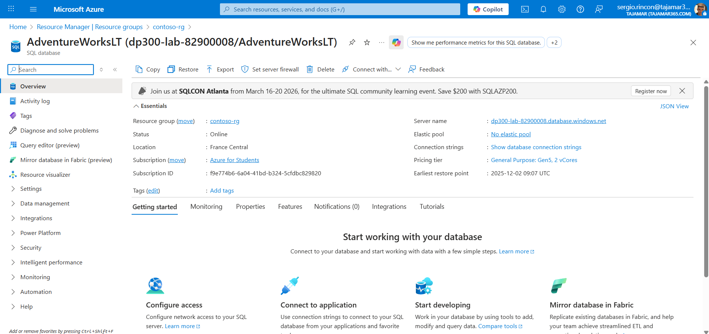

### 2. Configurar réplicas

1. En la sección **Administración de datos**, seleccione **Réplicas**
2. Seleccione **+ Crear réplica**

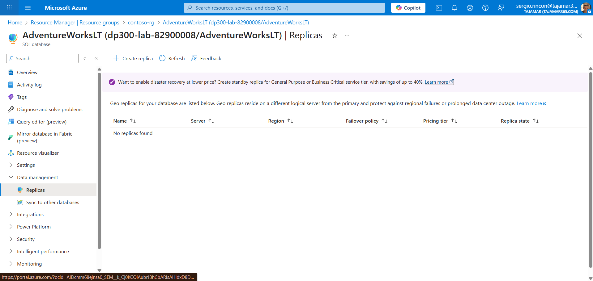

### 3. Configurar la réplica geográfica

En la página **Crear base de datos SQL - Réplica geográfica**, configure:

**Sección Configuración de réplica:**
- **Tipo de réplica:** Réplica geográfica

**Detalles de la base de datos geosecundaria:**
- **Suscripción:** La misma que la base de datos principal
- **Grupo de recursos:** El mismo que la base de datos principal
- **Nombre de la base de datos:** (Aparecerá en gris, mismo nombre que la principal)
- **Servidor:** Seleccione **Crear nuevo**

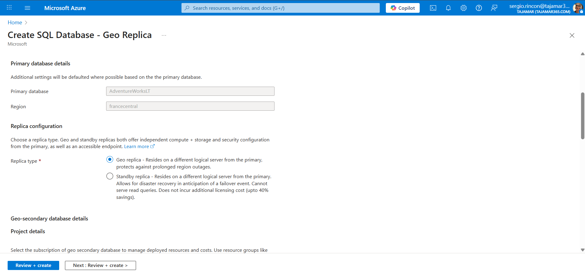

### 4. Crear servidor secundario

En la página **Crear servidor de base de datos SQL**, complete:

- **Nombre del servidor:** Nombre único para el servidor secundario
- **Ubicación:** Una región **diferente** a la base de datos principal
- ☑️ **Permitir que los servicios de Azure accedan al servidor**
- **Autenticación:** Autenticación SQL
  - **Inicio de sesión:** `sqladmin`
  - **Contraseña:** (Contraseña segura de 12+ caracteres)

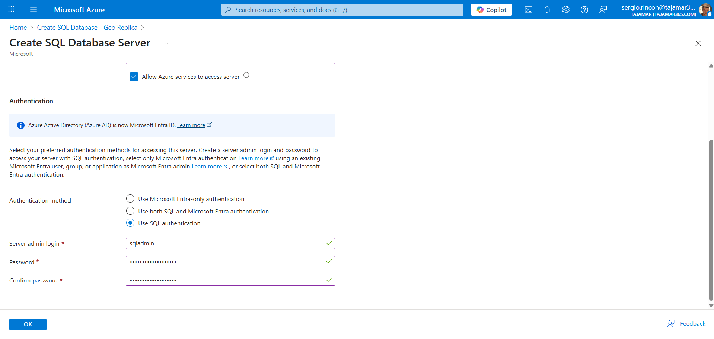

Seleccione **Aceptar**

### 5. Configurar opciones adicionales

- **¿Usar pool elástico?:** No
- **Computación + almacenamiento:** Propósito general, Gen 5, 2 núcleos virtuales, 32 GB
- **Redundancia de almacenamiento:** Almacenamiento con redundancia local (LRS)


### 6. Crear la réplica

1. Seleccione **Revisar + Crear**
2. Seleccione **Crear**

**Lo que debería verse:** Página de despliegue mostrando "Implementación en curso". Después de unos minutos cambiará a "Su implementación está completa".

3. Seleccione **Ir al recurso**

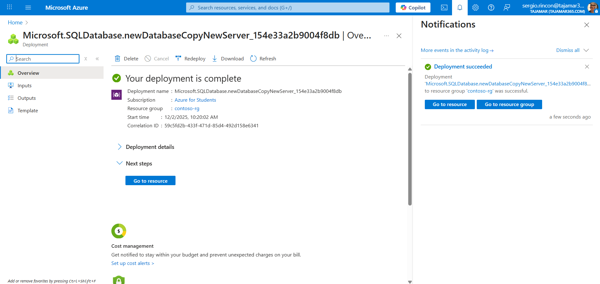

---

## Parte 4: Conmutación por Error a Región Secundaria

### 1. Acceder a las réplicas

1. Si no está en la base de datos secundaria, busque **bases de datos SQL**
2. Seleccione la base de datos **AdventureWorksLT** en el **servidor secundario**
3. En **Administración de datos**, seleccione **Réplicas**

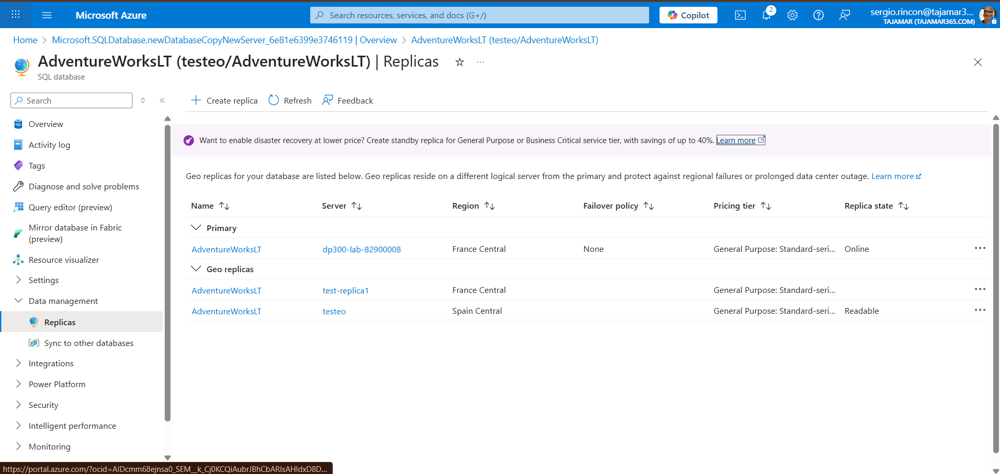

**Lo que debería verse:** Vista de réplicas mostrando el enlace de replicación geográfica establecido. La base de datos principal con estado "En línea" y la réplica geográfica con estado "Legible".

### 2. Realizar conmutación por error forzada

1. Seleccione el menú **…** para el servidor de réplica geográfica secundaria
2. Seleccione **Conmutación por error forzada**

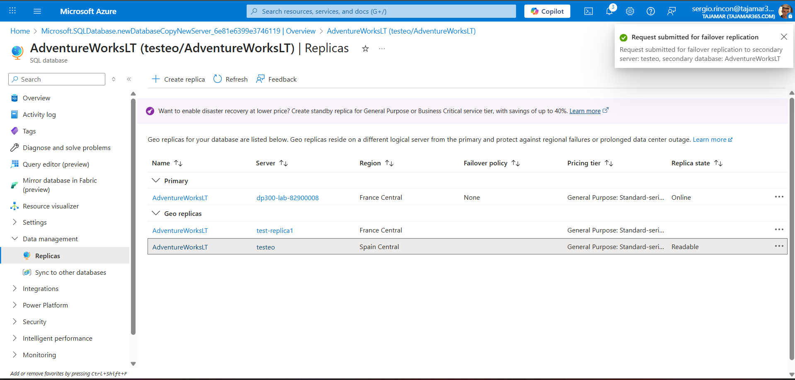

> 📝 La conmutación por error forzada cambiará la base de datos secundaria a la función principal. Todas las sesiones se desconectan durante esta operación.

3. Cuando aparezca el mensaje de advertencia, haga clic en **Sí**

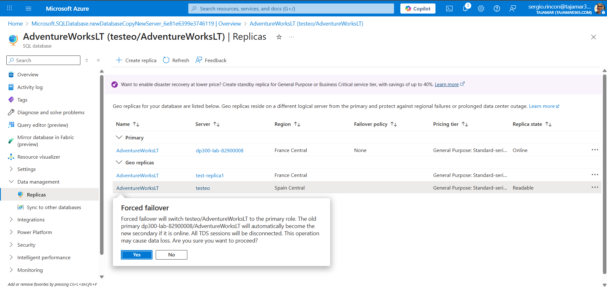

**Lo que debería verse:** Durante la conmutación, el estado de la réplica principal cambiará a "Pendiente" y el de la secundaria a "Conmutación por error". Después de unos momentos, los roles se intercambiarán.

### 3. Verificar el resultado

Una vez completada la conmutación por error:

**Lo que debería verse:** El servidor secundario ahora aparece como principal con estado "En línea", y el antiguo principal aparece como secundario con estado "Legible". Puede ser necesario actualizar la página para ver los cambios.

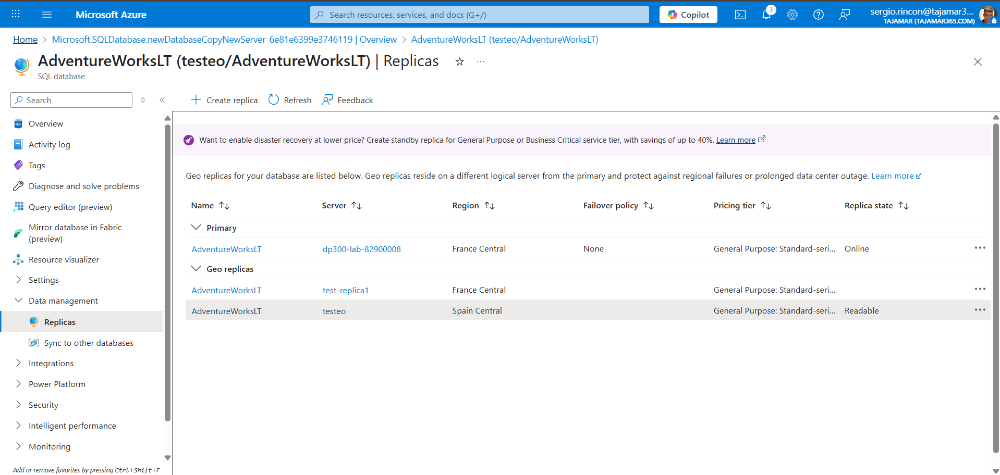

---

## ✅ Verificación

Has configurado exitosamente:
- ✓ Replicación geográfica entre dos regiones
- ✓ Conmutación por error manual a región secundaria
- ✓ Intercambio de roles entre servidores principal y secundario

---

## Limpieza de Recursos

### Opción 1: Eliminar el grupo de recursos completo

1. En Azure Portal, seleccione **Grupos de recursos**
2. Acceda al grupo de recursos del laboratorio
3. Seleccione **Eliminar grupo de recursos**
4. Escriba el nombre del grupo para confirmar
5. Seleccione **Eliminar**

### Opción 2: Eliminar únicamente los recursos del laboratorio

1. En Azure Portal, seleccione **Grupos de recursos**
2. Acceda al grupo de recursos del laboratorio
3. Seleccione todos los recursos con prefijo del nombre de SQL Server
4. Seleccione **Eliminar** en el menú superior
5. Escriba `eliminar` y confirme

### Opción 3: Eliminar la carpeta LabFiles

1. Abra el explorador de archivos
2. Navegue hasta `C:\`
3. Haga clic derecho en la carpeta **LabFiles**
4. Seleccione **Eliminar** y confirme

---

## Conclusión

¡Has completado este laboratorio exitosamente! 🎉

Has aprendido a:

- Configurar replicación geográfica en Azure SQL Database
- Crear réplicas geográficas en diferentes regiones
- Realizar conmutación por error forzada
- Gestionar roles entre servidores principal y secundario

Las bases de datos secundarias legibles pueden estar en la misma región de Azure que la principal o, más comúnmente, en una región diferente. Este tipo de bases de datos secundarias legibles también se conocen como **geosecundarias** o **georéplicas**.

---

## Conceptos Clave

### Replicación Geográfica
- Proporciona alta disponibilidad y recuperación ante desastres
- Permite réplicas legibles en diferentes regiones
- Sincronización asíncrona de datos

### Conmutación por Error
- **Conmutación por error forzada:** Cambia inmediatamente los roles (puede haber pérdida de datos)
- **Conmutación por error planeada:** Sincroniza antes de cambiar roles (sin pérdida de datos)

### Casos de Uso
- Recuperación ante desastres
- Distribución geográfica de lectura
- Migración entre regiones
- Balance de carga de consultas

---

## Recursos Adicionales

- [Documentación de Replicación Geográfica](https://docs.microsoft.com/azure/azure-sql/database/active-geo-replication-overview)
- [Grupos de conmutación por error](https://docs.microsoft.com/azure/azure-sql/database/auto-failover-group-overview)
- [Mejores prácticas de alta disponibilidad](https://docs.microsoft.com/azure/azure-sql/database/high-availability-sla)