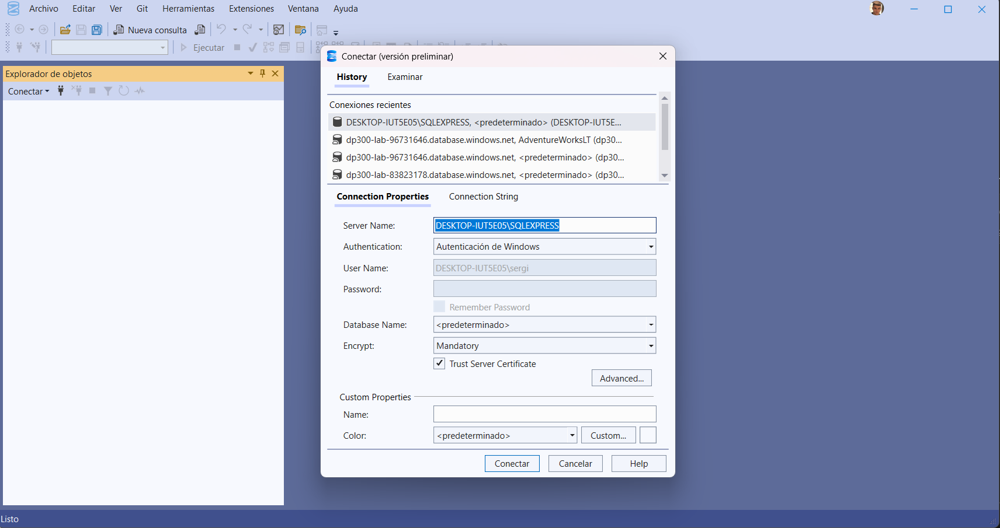
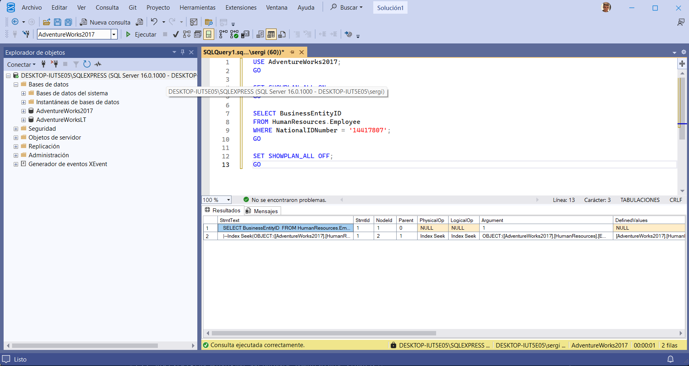
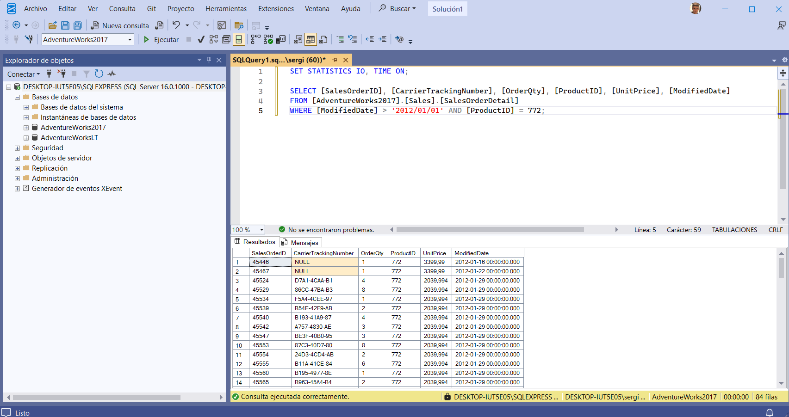
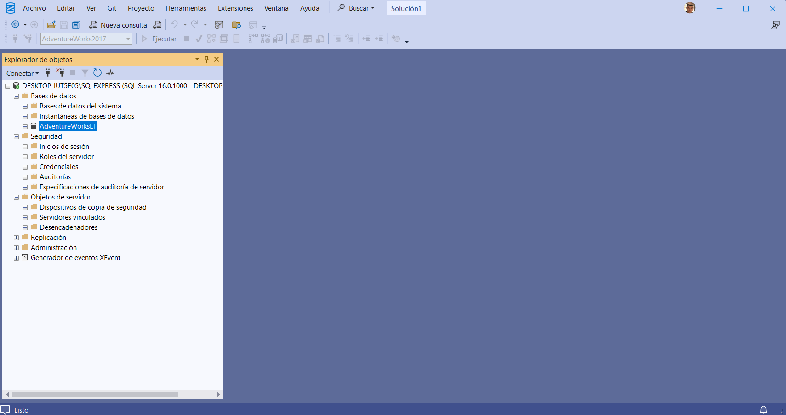

# Laboratorio 13: Identificación y resolución de problemas de rendimiento en SQL Server

## Objetivo
Identificar las áreas problemáticas en las consultas con bajo rendimiento en una base de datos SQL.

**Tiempo estimado:** 30 minutos

## Descripción
Has sido contratado como Administrador Senior de Bases de Datos para ayudar a resolver los problemas de rendimiento que se presentan al consultar la base de datos AdventureWorks2017. Tu trabajo consiste en identificar problemas en el rendimiento de las consultas y solucionarlos utilizando las técnicas aprendidas en este módulo.

---

## I. Entorno de configuración

### 1. Clonar el repositorio desde GitHub


Desde Visual Studio Code:
- Abre la paleta de comandos (`Ctrl+Shift+P`)
- Escribe `Git: Clonar` y selecciona la opción
- Pega la siguiente URL:
```
  https://github.com/MicrosoftLearning/dp-300-database-administrator.git
```
- Guarda el repositorio en `C:\LabFiles`


---

## II. Restaurar la base de datos AdventureWorks2017

### 2. Conectar con SQL Server Management Studio (SSMS)

📸 **Captura 3:** 

### 3. Restaurar la base de datos


Ejecuta el siguiente código T-SQL:
```sql
RESTORE DATABASE AdventureWorks2017
FROM DISK = 'C:\LabFiles\dp-300-database-administrator\Allfiles\Labs\Shared\AdventureWorks2017.bak'
WITH RECOVERY,
      MOVE 'AdventureWorks2017' 
        TO 'C:\LabFiles\AdventureWorks2017.mdf',
      MOVE 'AdventureWorks2017_log'
        TO 'C:\LabFiles\AdventureWorks2017_log.ldf';
```

📸 **Captura 5:** 

---

## III. Generar plan de ejecución real

### 4. Usar SHOWPLAN_ALL para ver el plan de ejecución en texto


```sql
USE AdventureWorks2017;
GO

SET SHOWPLAN_ALL ON;
GO

SELECT BusinessEntityID
FROM HumanResources.Employee
WHERE NationalIDNumber = '14417807';
GO

SET SHOWPLAN_ALL OFF;
GO
```
📸 **Captura 6:** 


---

## IV. Resolver un plan de consulta subóptimo

### 5. Ejecutar consulta con plan de ejecución gráfico


Habilita el plan de ejecución real (`Ctrl+M`) y ejecuta:
```sql
SET STATISTICS IO, TIME ON;

SELECT [SalesOrderID], [CarrierTrackingNumber], [OrderQty], [ProductID], [UnitPrice], [ModifiedDate]
FROM [AdventureWorks2017].[Sales].[SalesOrderDetail]
WHERE [ModifiedDate] > '2012/01/01' AND [ProductID] = 772;
```

📸 **Captura 7:** 

### 6. Mejorar el índice para eliminar Key Lookup


```sql
CREATE NONCLUSTERED INDEX [IX_SalesOrderDetail_ProductID]
ON [Sales].[SalesOrderDetail] ([ProductID],[ModifiedDate])
INCLUDE ([CarrierTrackingNumber],[OrderQty],[UnitPrice])
WITH (DROP_EXISTING = on);
GO
```

📸 **Captura 11:** 

---

## V. Utilizar Query Store para detectar regresión

### 7. Habilitar Query Store


```sql
USE [master];
GO

ALTER DATABASE [AdventureWorks2017] SET QUERY_STORE = ON;
GO

ALTER DATABASE [AdventureWorks2017] SET QUERY_STORE (OPERATION_MODE = READ_WRITE);
GO

ALTER DATABASE [AdventureWorks2017] SET COMPATIBILITY_LEVEL = 100;
GO
```
📸 **Captura 13:** 

### 8. Generar carga de trabajo


- Abre `C:\LabFiles\dp-300-database-administrator\Allfiles\Labs\10\CreateRandomWorkloadGenerator.sql`
- Ejecuta el script

📸 **Captura 14:** 

- Abre `C:\LabFiles\dp-300-database-administrator\Allfiles\Labs\10\ExecuteRandomWorkload.sql`
- Ejecuta el script dos veces

### 9. Cambiar nivel de compatibilidad a SQL Server 2022

📸 **Captura 15:** 
```sql
USE [master];
GO

ALTER DATABASE [AdventureWorks2017] SET COMPATIBILITY_LEVEL = 160;
GO
```

### 10. Analizar consultas que más recursos consumen

📸 **Captura 16:** 

- Actualiza la base de datos en el Explorador de objetos
- Expande **Query Store** > **Top Resource Consuming Queries**

📸 **Captura 17:** 

- Configura el filtro de planes mínimos a 2

📸 **Captura 18:** 

### 11. Forzar un mejor plan de ejecución

📸 **Captura 19:** 

- Selecciona el plan con menor duración
- Haz clic en **Force Plan**

📸 **Captura 20:** 

---

## VI. Utilizar sugerencias de consulta (Query Hints)

### 12. Ejecutar consultas con diferentes parámetros

📸 **Captura 21:** 
```sql
USE AdventureWorks2017;
GO

SELECT SalesOrderId, OrderDate
FROM Sales.SalesOrderHeader
WHERE SalesPersonID=288;
```

📸 **Captura 22:** 
```sql
USE AdventureWorks2017;
GO

SELECT SalesOrderId, OrderDate
FROM Sales.SalesOrderHeader
WHERE SalesPersonID=277;
```

### 13. Modificar consulta para usar variables

📸 **Captura 23:** 
```sql
USE AdventureWorks2017;
GO

SET STATISTICS IO, TIME ON;

DECLARE @SalesPersonID INT;
SELECT @SalesPersonID = 288;

SELECT SalesOrderId, OrderDate
FROM Sales.SalesOrderHeader
WHERE SalesPersonID= @SalesPersonID;
```

### 14. Aplicar sugerencia RECOMPILE

📸 **Captura 24:** 
```sql
USE AdventureWorks2017
GO

SET STATISTICS IO, TIME ON;

DECLARE @SalesPersonID INT;
SELECT @SalesPersonID = 288;

SELECT SalesOrderId, OrderDate
FROM Sales.SalesOrderHeader
WHERE SalesPersonID= @SalesPersonID
OPTION (RECOMPILE);
```

📸 **Captura 25:** 

---

## VII. Limpieza

### 15. Eliminar la base de datos

📸 **Captura 26:** 

- Clic derecho en **AdventureWorks2017** > **Delete**
- Marca **Close existing connections**
- Selecciona **OK**

📸 **Captura 27:** 

---

## Conclusiones

En este laboratorio aprendiste a:
- ✅ Generar y analizar planes de ejecución
- ✅ Identificar y resolver Key Lookups mediante índices de cobertura
- ✅ Utilizar Query Store para detectar regresiones de rendimiento
- ✅ Forzar planes de ejecución óptimos
- ✅ Aplicar query hints (RECOMPILE) para mejorar el rendimiento

**Laboratorio completado exitosamente** 🎉