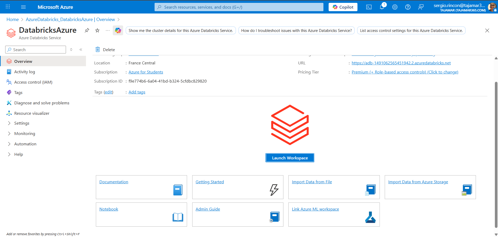
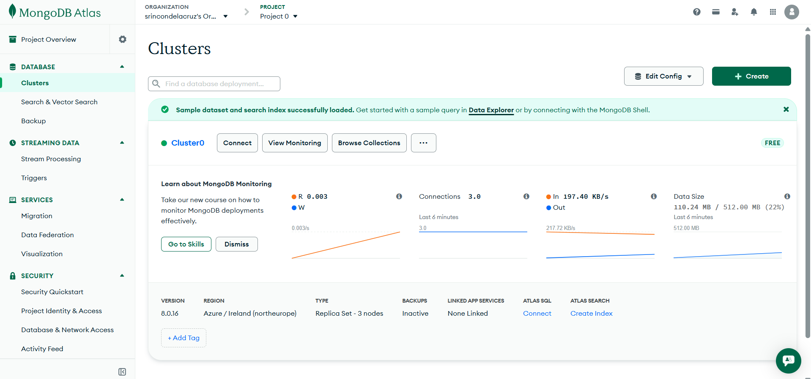
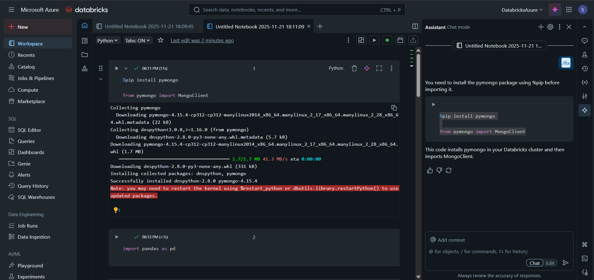
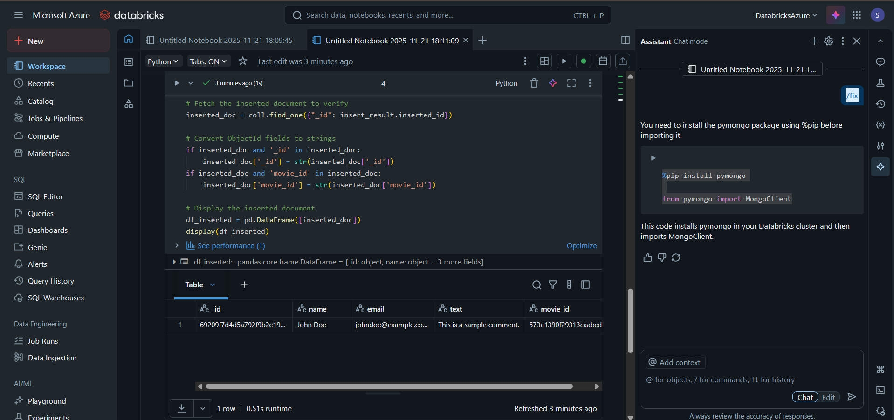
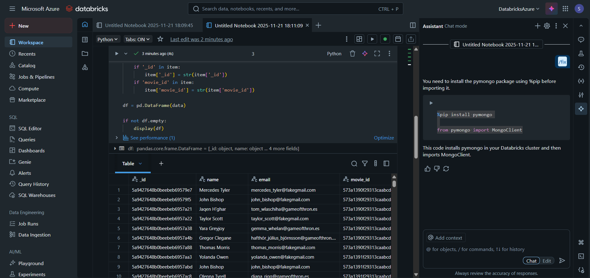

Tutorial: Integración de Azure Databricks con MongoDB Atlas
Este documento describe paso a paso cómo configurar un entorno en Azure Databricks, conectarlo a un clúster de MongoDB Atlas, instalar las librerías necesarias y realizar consultas de datos utilizando Python y Pandas.

Requisitos Previos
Una cuenta de Azure con suscripción activa.

Un clúster de MongoDB Atlas desplegado.

Paso 1: Iniciar el Espacio de Trabajo en Azure
Lo primero es acceder al servicio de Azure Databricks desde el portal de Azure.

Navega a tu recurso de Azure Databricks.

En la pestaña de "Overview" (Visión general), localiza y haz clic en el botón "Launch Workspace" (Iniciar espacio de trabajo).

Paso 2: Verificar el Clúster de MongoDB
Antes de conectar, asegúrate de que tu base de datos en MongoDB Atlas está activa y accesible.

Entra en tu consola de MongoDB Atlas.

Verifica que el clúster (ej. Cluster0) esté en estado verde (activo).

Ten a mano tu cadena de conexión (Connection String) para usarla posteriormente en el código.

Paso 3: Instalación de Librerías en Databricks
Para que Databricks pueda "hablar" con MongoDB, necesitas instalar el driver oficial de Python (pymongo).

Crea o abre un Notebook en Databricks.

Ejecuta el siguiente comando mágico para instalar la librería en el clúster actual:

Python

%pip install pymongo
Importa el cliente:

Python

from pymongo import MongoClient
Nota: Es posible que veas un mensaje indicando que necesitas reiniciar el kernel de Python para usar los paquetes actualizados.

Paso 4: Verificación de Inserción de Datos (Un solo documento)
Una vez establecida la conexión (código de conexión no mostrado en capturas, pero se asume client = MongoClient(...)), procedemos a verificar que podemos recuperar datos.

El siguiente código busca un documento específico usando su ID, convierte los campos de tipo ObjectId a string (para compatibilidad con Pandas) y lo muestra.

Código de ejemplo:

Python

# Fetch the inserted document to verify
inserted_doc = coll.find_one({"_id": insert_result.inserted_id})

# Convert ObjectId fields to strings
if inserted_doc and '_id' in inserted_doc:
    inserted_doc['_id'] = str(inserted_doc['_id'])
if inserted_doc and 'movie_id' in inserted_doc:
    inserted_doc['movie_id'] = str(inserted_doc['movie_id'])

# Display the inserted document
df_inserted = pd.DataFrame([inserted_doc])
display(df_inserted)
Paso 5: Consulta y Visualización Masiva de Datos
Finalmente, podemos recuperar múltiples documentos, procesarlos para limpiar los tipos de datos (como los ObjectId) y presentarlos en una tabla interactiva de Databricks.

En este paso se itera sobre los elementos de la colección, se transforman los IDs y se crea un DataFrame completo con datos como nombre, email y comentarios.

Código de ejemplo:

Python

# (Dentro de un bucle for para procesar 'data')
if '_id' in item:
    item['_id'] = str(item['_id'])
if 'movie_id' in item:
    item['movie_id'] = str(item['movie_id'])

df = pd.DataFrame(data)

if not df.empty:
    display(df)

